# Kemono
游戏名称  | 游戏类型  | 支持语言 | 发行日期 | 成人内容 | 游戏介绍 | 获取方式
:-------------: | :-------------: | :-------------: | :-------------: | :-------------: | :-------------: | :-------------:
形骸骑士 | 平台动作 | 简体中文 | TBA  | 无 | [阅读详情](#形骸骑士) | TBA
罗曼圣诞探案集 | 文字冒险 | 简体中文 | TBA  | 无 | [阅读详情](#罗曼圣诞探案集) | [Steam 商店](https://store.steampowered.com/app/926340/Romans_Christmas/)
Backbone | 文字冒险 | 英文 | TBA  | 无 | [阅读详情](#Backbone) | [Steam 商店](https://store.steampowered.com/app/865610/Backbone/)
TUNIC | 动作 | 英文 | TBA  | 无 | [阅读详情](#TUNIC) | [Steam 商店](https://store.steampowered.com/app/553420/TUNIC/)
生化变种 | 角色扮演 | 英文 | TBA  | 无 | [阅读详情](#生化变种) | [Steam 商店](https://store.steampowered.com/app/597820/BIOMUTANT/)
厄运七人组 | 恐怖 | 简体中文 | TBA  | 无 | [阅读详情](#厄运七人组) | [Steam 商店](https://store.steampowered.com/app/579120/Unlucky_Seven/)
Lovers of Aether | 视觉小说 | 英文 | 2019年4月1日  | 无 | [阅读详情](#Lovers-of-Aether) | [Steam 商店](https://store.steampowered.com/app/1043180/Lovers_of_Aether/)
超级动物大逃杀 | 射击生存 | 简体中文 | 2018年12月12日  | 无 | [阅读详情](#超级动物大逃杀) | [Steam 商店](https://store.steampowered.com/app/843380/Super_Animal_Royale/)
绿叶之冠 | 视觉小说 | 英文 | 2018年11月27日  | 无 | [阅读详情](#绿叶之冠) | [Steam 商店](https://store.steampowered.com/app/604330/The_Crown_of_Leaves/)
喵喵战争 | 卡牌 | 简体中文 | 2018年8月8日  | 无 | [阅读详情](#喵喵战争) | [Steam 商店](https://store.steampowered.com/app/762110/Meow_Wars_Card_Battle/)
秘密之礁湖 重制版  | 视觉小说 | 简体中文 | 2018年7月6日  | [R18补丁](http://www.kaiju09.com/lagoonloungeEnglish/) | [阅读详情](#秘密之礁湖-重制版) | [Steam 商店](https://store.steampowered.com/app/857690/Lagoon_Lounge__The_Poisonous_Fountain/)
Just, Bearly | 模拟 | 英文 | 2018年5月31日  | 无 | [阅读详情](#Just-Bearly) | [Steam 商店](https://store.steampowered.com/app/792030/Just_Bearly/)
Amorous | 视觉小说 | 英文 | 2018年4月14日  | 无 | [阅读详情](#Amorous) | [Steam 商店](https://store.steampowered.com/app/778700/Amorous/)
Changed | 解谜 | 简体中文 | 2018年4月5日  | 无 | [阅读详情](#Changed) | [Steam 商店](https://store.steampowered.com/app/814540/Changed/)
The Pirate's Fate | 视觉小说 | 英文 | 2018年3月27日  | 无 | [阅读详情](#The-Pirates-Fate) | [Steam 商店](https://store.steampowered.com/app/553480/The_Pirates_Fate/)
Winds of Change | 视觉小说 | 英文 | 2018年3月22日  | 无 | [阅读详情](#Winds-of-Change) | [Steam 商店](https://store.steampowered.com/app/594130/Winds_of_Change/)
家有大猫  | 视觉小说 | 简体中文 | 2017年11月13日  | [R18补丁](https://store.nekojishi.tw/zh/product/nekojishi_limited/) | [阅读详情](#家有大猫) | [Steam 商店](https://store.steampowered.com/app/570840/_Nekojishi/)
尾牙 | 策略 | 简体中文 | 2017年9月13日  | 无 | [阅读详情](#尾牙) | [Steam 商店](https://store.steampowered.com/app/286000/Tooth_and_Tail/)
亮晶晶：闪闪王国 | 动作角色扮演 | 英文 | 2017年4月18日  | 无 | [阅读详情](#亮晶晶：闪闪王国) | [Steam 商店](https://store.steampowered.com/app/366640/Shiness_The_Lightning_Kingdom/)
林中之夜 | 文字冒险 | 英文 | 2017年2月21日  | 无 | [阅读详情](#林中之夜) | [Steam 商店](https://store.steampowered.com/app/481510/Night_in_the_Woods/)
鳞翼天使 | 视觉小说 | [汉化补丁](https://steamcommunity.com/sharedfiles/filedetails/?id=1631230813) | 2017年2月1日  | 无 | [阅读详情](#鳞翼天使) | [Steam 商店](https://store.steampowered.com/app/571880/Angels_with_Scaly_Wings/)
大调小调完整版 | 视觉小说 | 英文 | 2016年10月11日  | 无 | [阅读详情](#大调小调完整版) | [Steam 商店](https://store.steampowered.com/app/475490/MajorMinor__Complete_Edition/)
传说：命运之路 | 动作角色扮演 | [汉化补丁](https://steamcn.com/t429856-1-1) | 2016年4月12日  | 无 | [阅读详情](#传说：命运之路) | [Steam 商店](https://store.steampowered.com/app/439190/Stories_The_Path_of_Destinies/)
阿门罗 | 卡牌策略 | 简体中文 | 2015年9月2日  | 无 | [阅读详情](#阿门罗) | [Steam 商店](https://store.steampowered.com/app/290340/Armello/)
凯之传奇 | 角色扮演 | 英文 | 2015年7月28日  | 无 | [阅读详情](#凯之传奇) | [Steam 商店](https://store.steampowered.com/app/313810/Legend_of_Kay_Anniversary/)
FaceRig | 视频软件 | 简体中文 | 2015年7月7日  | 无 | [阅读详情](#FaceRig) | [Steam 商店](https://store.steampowered.com/app/274920/FaceRig/)

## 形骸骑士
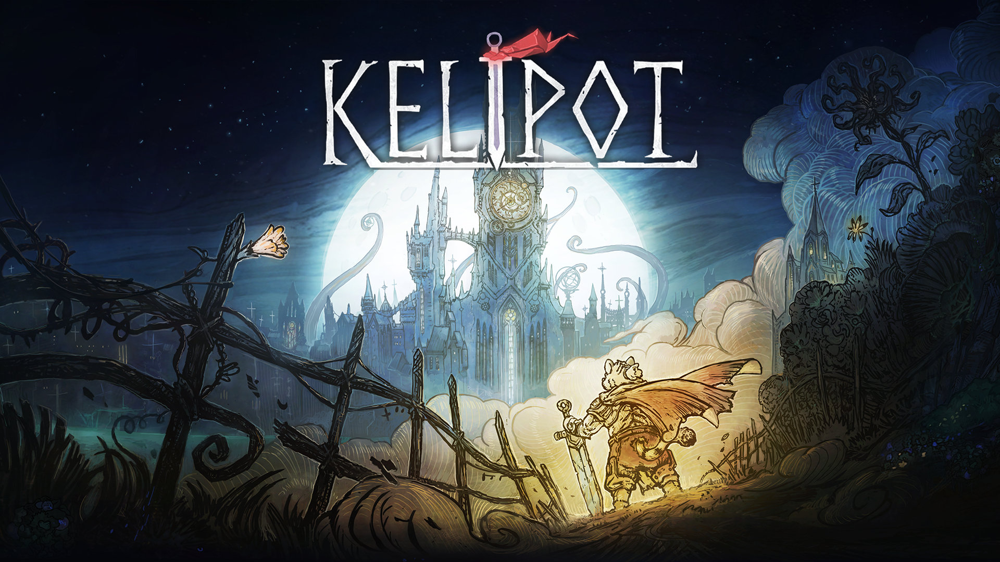
> 神秘的瘟疫，突然降临在古老的塞勒菲斯，当白虎双子深陷其中，他们将如何选择？
> 
> 在这无限的轮回中探寻，甚至利用银匙的力量改变过去，最终要如何找到埋藏在这个疯狂的世界之下的答案？
> 
> 《形骸骑士》是一款平台动作Roguelite游戏，拥有丰富的剧情体验，并且全部使用经典的手绘2D风格绘制。

官方微博：[Kelipot形骸骑士](https://www.weibo.com/kelipot)

## 罗曼圣诞探案集
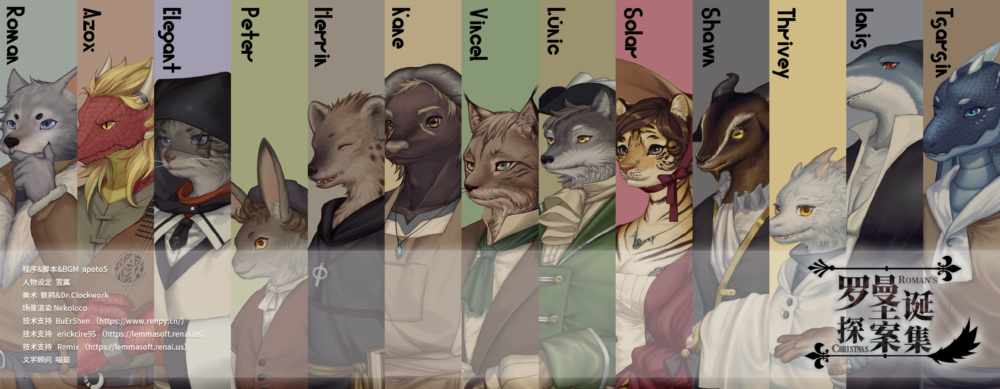
> 又是一年圣诞，狼人侦探罗曼打算在酒馆好好度过一个没有案件缠身的假期。
> 
> **扮演罗曼解决酒馆内的谜题**
> 
> 因为暴雪的缘故，13 位性格各异的旅客被困在酒馆里，表面平静的酒馆随时会爆发深埋多年的积怨。准备好应对旅客之间的明争暗斗，帮助旅馆老板解决酒馆里的疑案。
> 
> **体验*垩坡利恩*的风土人情**
> 
> 太阳底下无新事，但是在太阳之国*垩坡利恩*却不同。这个有着许多种族兽人的国度与人类世界有诸多不同，而酒馆正是风俗习惯的聚集地。在没有凶杀案的闲暇时光里，多跟酒客交流吧。
> 
> **达成多种结局**
> 
> 随着你的每个选择，你的未来会被导向不同的境遇。如果拥有回溯时间的能力，也许能让大家愉快地度过一个圣诞假日？
> 
> **本游戏含轻微血腥内容**（我也没办法去掉毕竟这是个天杀的侦探游戏）

官方微博：[罗曼圣诞探案集](https://weibo.com/u/5903993211)

## Backbone
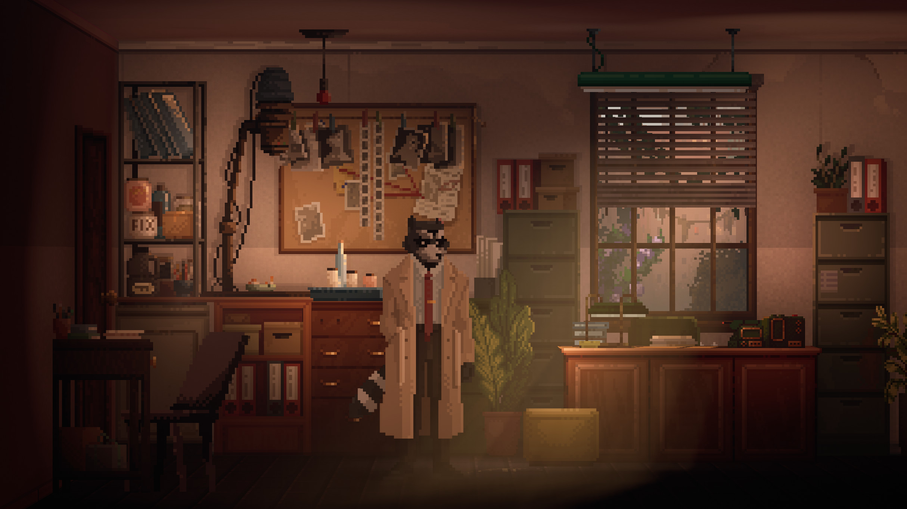
> Backbone is a noir-inspired detective adventure. As raccoon private eye Howard Lotor, sniff out clues, collect evidence, interrogate witnesses, and explore beautiful pixel art version of dystopian Vancouver, BC.
> 
> Howard Lotor is smart, self-assured and set in his ways. Caught in the tedium of day-to-day life, he’s resigned to the abuses of the authoritative regime in power and compliant with the systemic inequality that permeates society. But a string of cases that grow progressively more outlandish will put his worldview to the test. 
> 
> Backbone's gameplay is a new take on point-and-click adventure, featuring stealth, exploration, and extensive branching dialogues inspired by classic CRPGs. As Howard, you must traverse the diverse districts of a now walled-off Vancouver, sniff out clues, collect evidence, interrogate witnesses, and choose which leads to follow. 
> 
> Inspired by film noir, Backbone will submerge you into its dark dystopian atmosphere. Every animation in the game is handcrafted frame by frame, and environments are modeled after real streets of Vancouver, BC. The breathtaking combination of high resolution pixel art and 3D effects like dynamic lighting, pouring rain, volumetric fog and neon lights bring the sprawling city to life. Original doom jazz soundtrack will keep you on the edge with the enveloping veil of bebop and cinematic soundscapes, where every sound tells a story.

## TUNIC
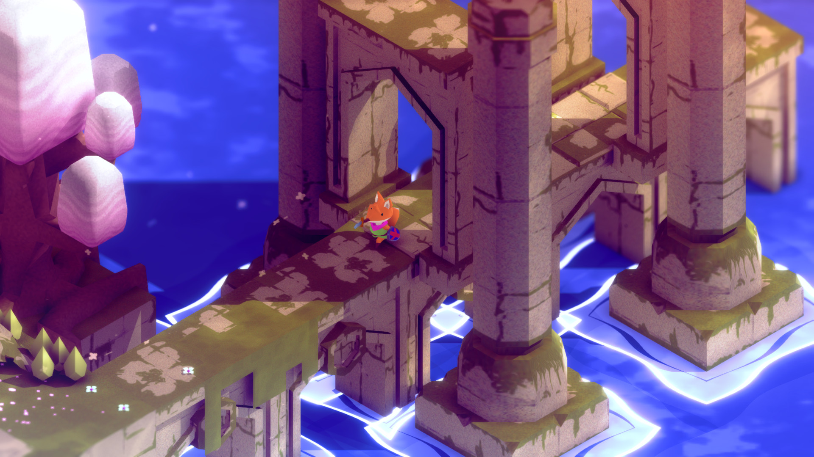
> TUNIC is an action adventure about a tiny fox in a big world. Explore the wilderness, discover spooky ruins, and fight terrible creatures from long ago.

## 生化变种

> BIOMUTANT is an open-world, post-apocalyptic Kung-Fu fable RPG, with a unique martial arts styled combat system allowing you to mix melee, shooting and mutant ability action.
> 
> A plague is ruining the land and the Tree-of-Life is bleeding death from its roots. The Tribes stand divided. Explore a world in turmoil and define its fate – will you be its saviour or lead it to an even darker destiny?

## 厄运七人组
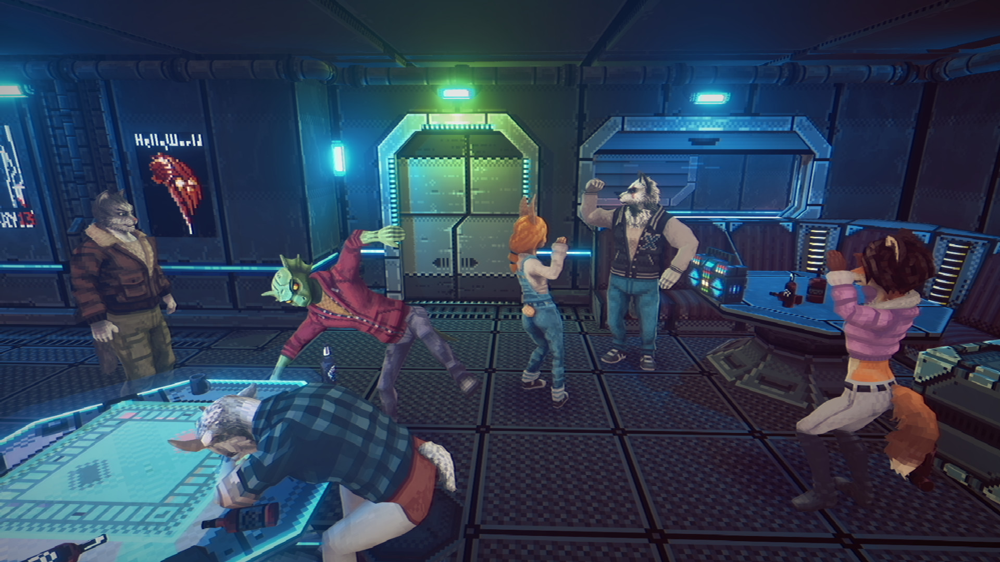
> 《厄运七人组》将会带您来一场太空漫步，并体验一个爱恨交集，与渴望人肉的故事。
> 
> 艾伦的朋友们总是喜欢庆祝特别场合，他们错过了匿名戒酒会，跑去参加了一个豪华汽车旅馆的生日派对。不幸的是，派对的主人因为吃了一口美味的人肝香肠而食欲大增。他们的庆生派对即将成为死亡派对...
> 
> 在这个美丽的像素写实风世界中尽情冒险！你所做的每一个选择都将决定你朋友们的命运。探索参与者们的动机与欲望，并破坏他们的阴谋吧！

## Lovers of Aether
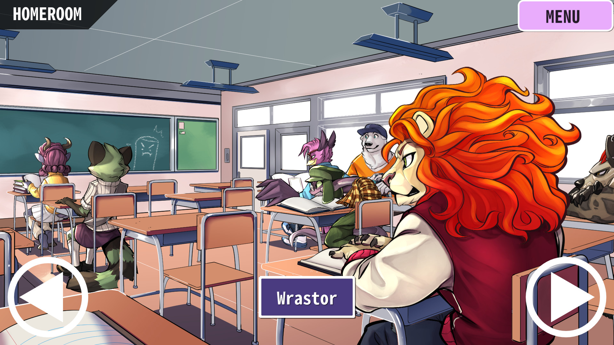
> Are you tired of fighting? Lovers of Aether is the game for you! This is a wholesome animal dating simulator set in the world of Rivals of Aether.

## 超级动物大逃杀
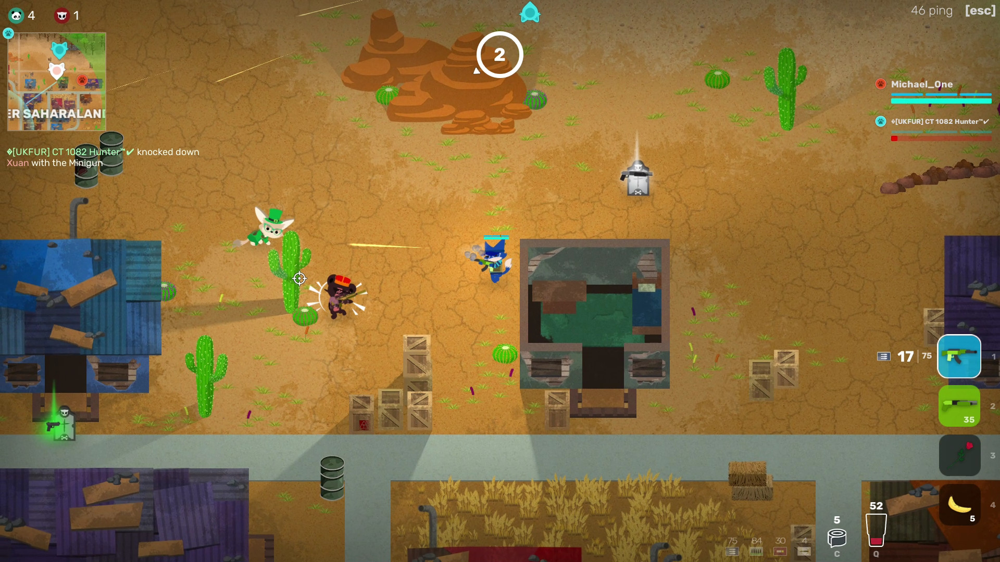
> **为了生存而战：**
> 
> 超级动物大逃杀是一款创意十足，刺激且充满战略性的上帝视角大逃杀。在各种异域风情的生物群落中参与这场由最多64名可爱杀手动物的尖牙利爪(还有机关枪)大乱斗吧！这里的动物们都为了成为最强狗狗(或最强猫咪、最强树懒...之类的)而战！
> 
> * 以上帝视角在紧张刺激的氛围中享受这款创新的大逃杀体验。
> * 直观的战争迷雾系统让你能够使用潜行来进行战略突袭。
> * 探索这座巨大且美丽的，拥有各式各样的生态群落与一座历经沧桑的超级野生动物园遗迹的天堂岛屿。
> * 砍掉高耸的杂草堆来发现藏在其中的物品，因为对付杂草不必留情。
> 
> **为什么要叫作「超级」试玩版呢?**
> 
> 嗯...除了在每样东西前面加上「超级」会让他更棒以外，这个试玩版同时也让你能尽情游玩完整的在线模式，随便你玩喔！而且你还可以开始记录你的进度，并获得物品与动物DNA。在试玩版中所赚取的物品会暂时被锁定，所以你无法解锁新动物或把他们打扮成你喜欢的样子，但如果你喜欢这款游戏并决定要购买的话，你在试玩版中所获得的所有进度与物品都会直接转移到完整版中！还蛮「超级」的，对吧？只希望试玩版没超级过头反而让你不想购买正式版了，不过我们还是对这款游戏作品与它所建立起的玩家社区感到非常自豪，所以我们认为让你亲自体验游戏的魅力更会让你觉得这是一款值得支持的抢先体验游戏！
> 
> **不断进化与改善的游戏内容：**
> 
> 直观的上帝视角与简单易懂的机制让这款成为了目前最好上手的大逃杀游戏，而对于进阶玩家我们同时也保留了非常具有深度的战略与技术奖励。此外，无论您是在Macbook或是PC上游玩，我们出色的优化都能让你流畅地进行游戏。
> 
> 随着游戏更新，小岛和基因工程超级动物的名单不断（啊咳）进化。您的超级动物可以通过全新的服装、墓碑、死亡爆炸效果、武器和舞蹈动作等进行个性化定制。就算游戏打得菜，皮肤还是可以一套一套买的。
> 
> 加入超级动物世界，一起来看看我们正与抢先体验社区进行着哪些工作，并为游戏的发展做出贡献！

## 绿叶之冠
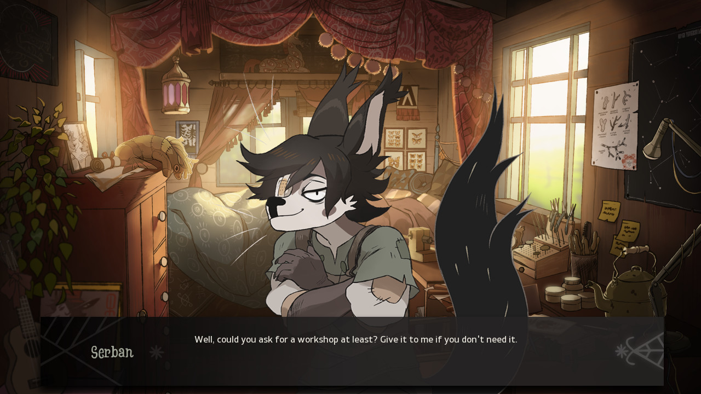
> Roui, a resilient city dandy, a half-educated jeweler and the author of scientific magic articles, was met with a colossal failure and must return to his homeland Latori.

## 喵喵战争
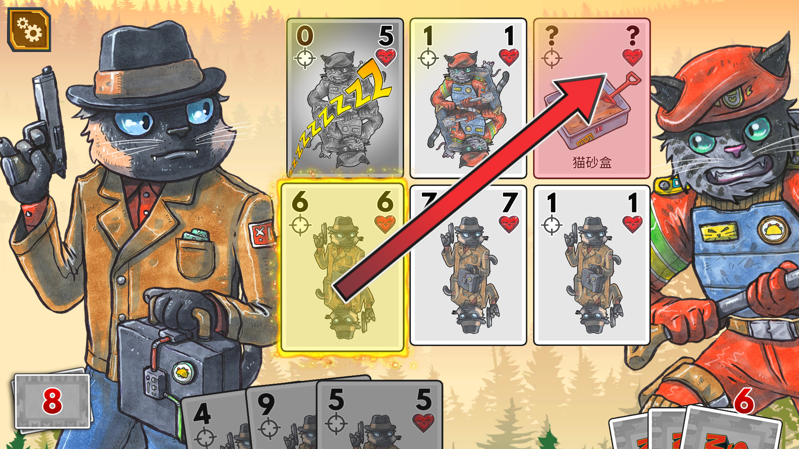
> Meow Wars是一个猫主题的卡牌战斗游戏，具有极易掌握的机制和迷人的手绘人物。一路争战，战胜每个挑战者，接近 指挥官卡特拉特并从他的铁腕下解放猫岛。每个阶段都会向令人信服的猫科动物故事中引入一只新猫和新的卡牌能力。在PVP对决中挑战您的朋友，或者测试您对抗全球观众的力量。 

## 秘密之礁湖 重制版
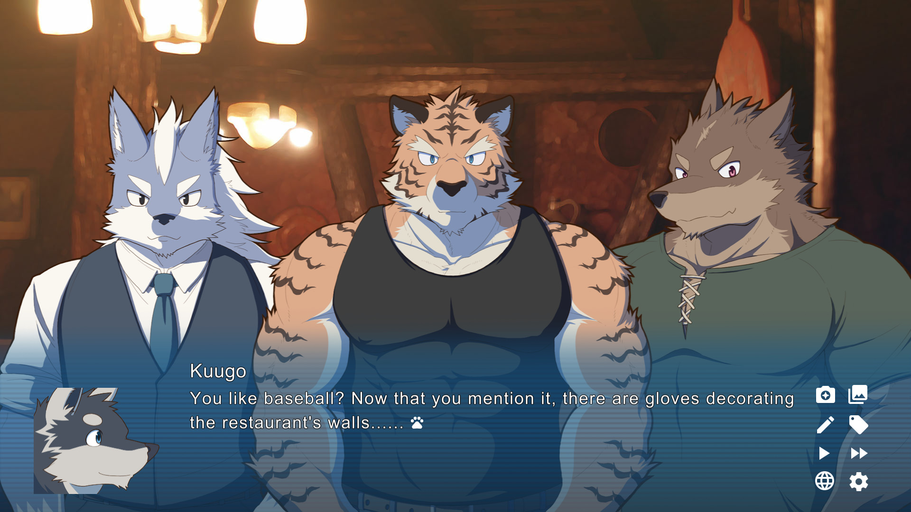
> 这是一部包含兽人角色与同性恋爱主题的视觉小说游戏。你将在游戏内扮演一名兽人角色，搬到湖边的小村子居住，和当地的村民生活在一起。
> 
> **故事剧情**
> 
> 游戏主角是一位兽人，在工作上积劳成疾，不得不选择辞职。为了养伤，他听从老朋友的建议，搬到朋友所住的湖边小村。
> 
> 搬来之前，村子里出现名为“春洲之巨人”的奇怪现象，不时有神秘的巨响和地震。
> 
> 对此好奇的游客大量涌入村子。
> 
> 主角在饭店任职服务员，和他的朋友一起工作。
> 
> 搬家后没多久，主角的朋友向他发出警告。
> 
> 「千万别靠近村里广场中的喷泉。」
> 
> 他很快就会发现，喷泉带来的是什么样的威胁。
> 
> **游戏内容**
> 
> 这部视觉小说游戏包含兽人角色与同性恋爱内容。游戏系统注重提供便利的游戏体验。
> 
> 因此你可以在通关后选择任意章节继续游戏，并做出不同的选择。
> 
> **语言**
> 
> 游戏支持多种语言。在游戏过程中，随时都可以按键切换语言。
> 
> 是学习新语言的好机会。

## Just, Bearly
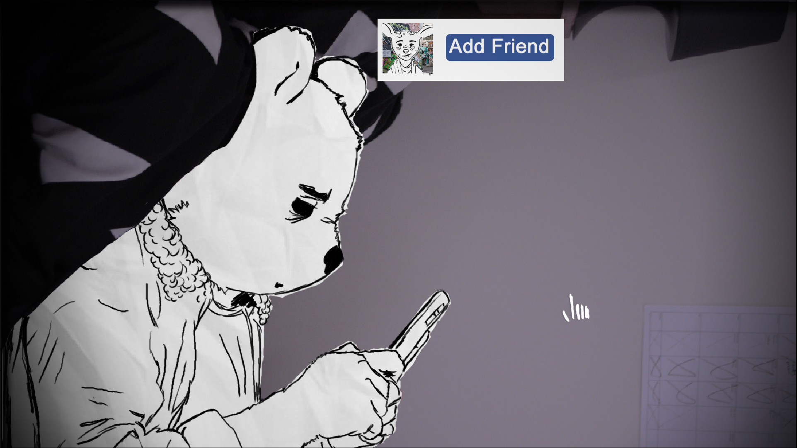
> An honest comedy about anxiety and feeling awkward, played through painfully relatable mini games.
> 
> A comedic story game played in vignettes, about feeling anxious as a bear in inner city Melbourne, Australia, and trying to connect to people none the less. 
> 
> Click, pull, mash, and guide your way through an ever changing mix of dialogue choices, reaction challenges, dexterity tests, rhythm games and God only knows what else as you overthink and under-perform your way through every day life -- Striving towards greatness and being less of an awkward, anxious, crap.

## Amorous
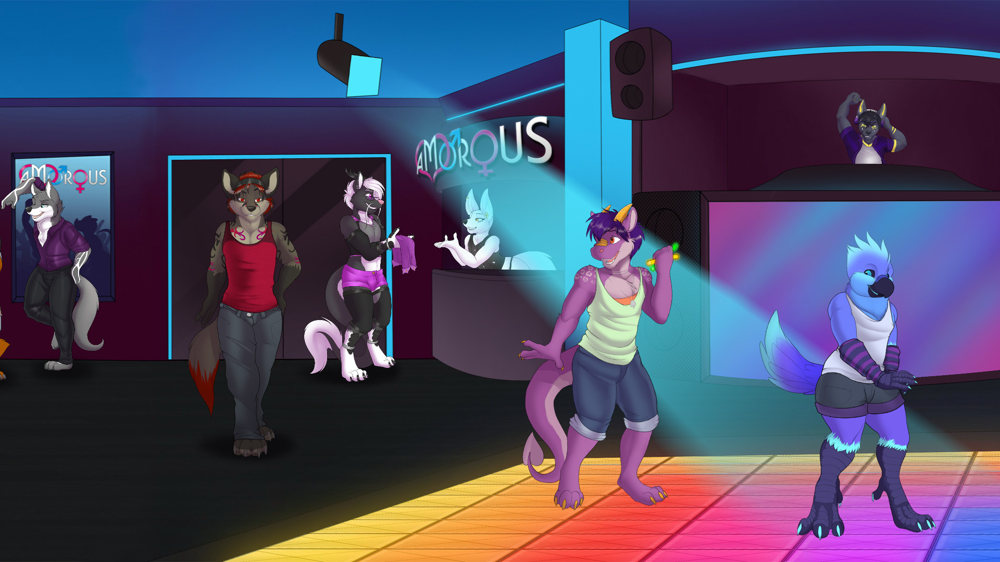
> Explore the dazzling neon lights of Amorous. A bustling furry night club that attracts all species, personalities and sexualities. Create your own character and find all 9 datable characters!

## Changed

> 《Changed》是一款颇有难度，拥有大量追逐战的动作解谜类游戏。
> 
> 游戏主角在陌生的房间中苏醒，来到了一个陌生的实验楼。
> 
> 冒险中，他会遇到形形色色的未知生物，每一种都可以轻易“掠夺”他的躯体，他只能进行不断的探索，试图走出这个危机四伏的建筑。
> 
> 在这个草木皆兵的新世界里，暗自引导他走出去的究竟是谁？为什么他会被困在这里？外面的世界究竟遭遇了什么？
> 
> 种种谜团错综复杂，真相将在一步步交互与探索中慢慢浮出水面。
> 
> 当然，要小心，不要迷失在这个建筑……

官方微博：[Changed游戏官博](https://weibo.com/u/6485580433)

## The Pirate's Fate
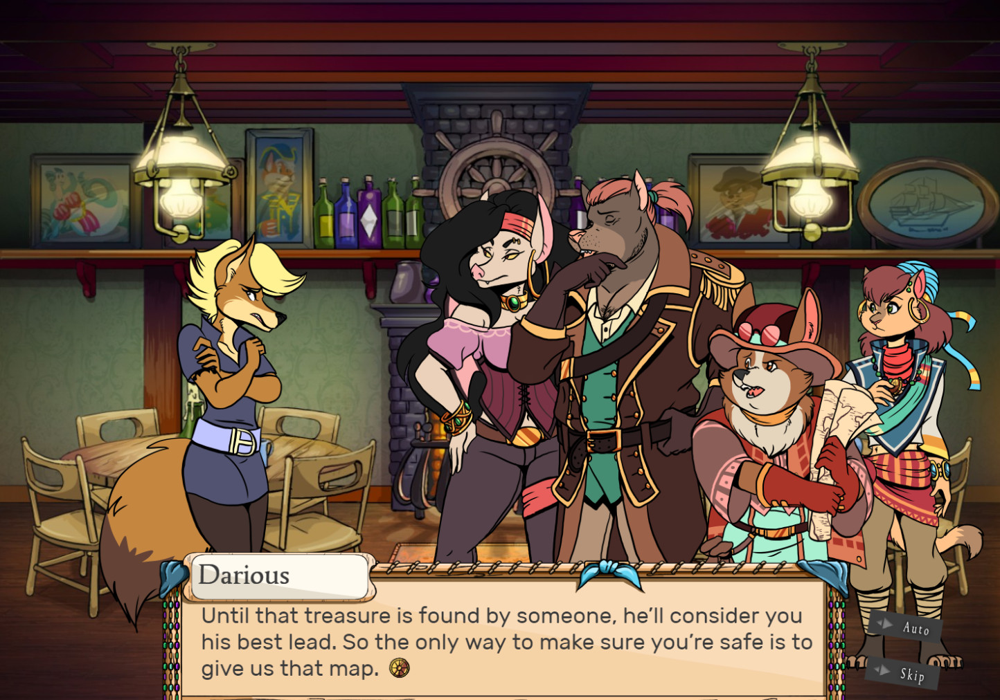
> Embark on a swashbuckling adventure in The Pirate's Fate, a visual novel experience with a unique twist: the story, the crew, and who you are transform based on your choices. Seek treasure, find love, and choose your fate.

## Winds of Change
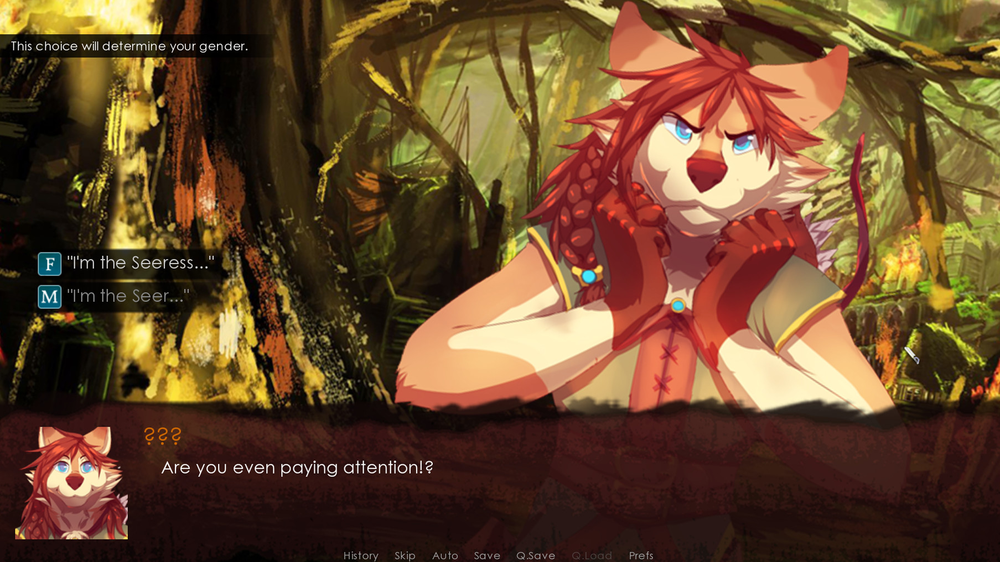
> Lead The Rebellion, build your army, and shape the world with your choices. A story-heavy adventure game with multiple endings, romance options, and non-linear storytelling. A vast dark fantasy world waiting to be explored. Inspired by Dragon Age, and Mass Effect. Fully voice acted by a stellar cast!

## 家有大猫
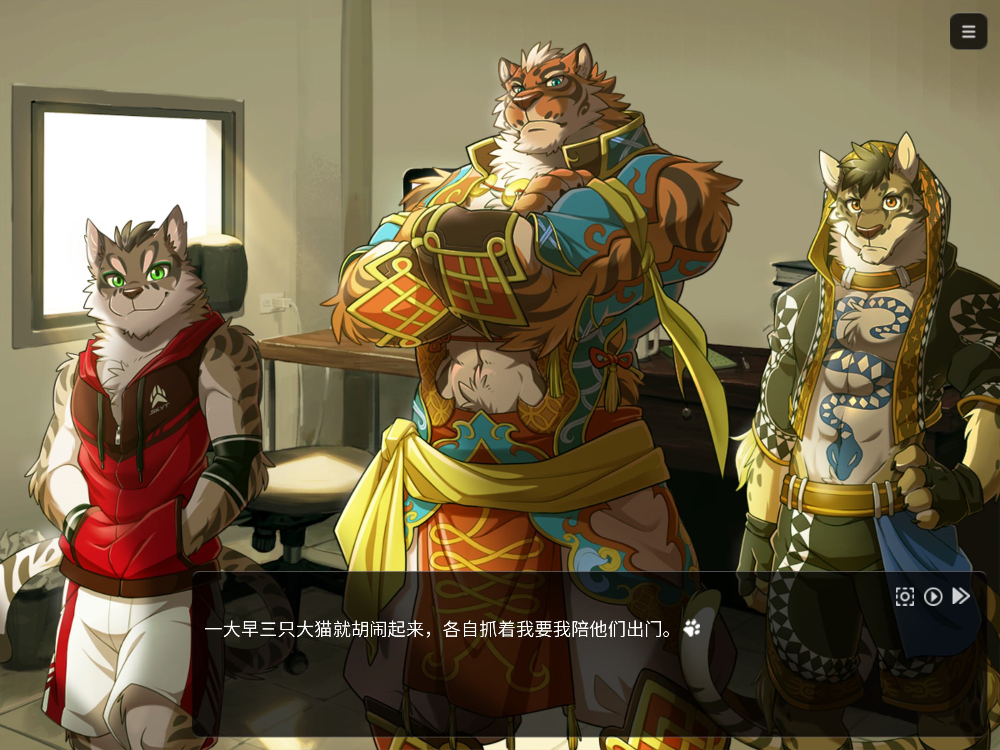
> 这是一个关于某个普通大学生突然看到了三位猫科动物神灵的故事。
> 
> **有没有幻想过毛茸茸的兽人出现在身边？如果他们是自幼就听过大名的神明怎么办？在家有大猫的故事中，你会很快发现美梦成真需要付出的代价。**
> 
> 神像里真的住着守护神，祭祀的表演台下也有神明观看？家里世代是乩童，但如今只是个普通大学生的林天辽，从没想过身边会突然多出三个猫科兽人神灵。
> 
> 得到了封印已久的灵力，看到了原本隐形的神明。对此一点都不兴奋的林天辽，作为普通人的生活还要继续。穿梭在日常与非日常间，他与三只大猫一起的故事匆匆开始了。
> 
> 还没有来得及让他庆幸自己有了阴阳眼，几个突然出现的神灵就开始给阿辽规划起了人生。林家的守护神林虎希望阿辽能在毕业后回老家从事神职，原住民部落的云豹神灵李克劳则相信阿辽是部落新祭司的最佳人选。就连学校舞蹈社的学长颜书齐，也被不知道从哪里来的石虎精给附了身，一直拖着阿辽想让他陪自己为一个乡下小庙复兴香火。还没搞清楚到底发生了什么的阿辽，就这样被推进了不一样的世界线。
> 
> 令阿辽意外的是，这些神灵并非如他想象的那般迂腐，这也让这个不关心鬼神之事的孩子重新思考起民间信仰在现代的意义。不过，他的课程表可不允许他来做个传统文化大巡礼，所以现在要由你来为他做决定了。
> 
> **家有大猫的故事含有同性恋爱的剧情。**

官方微博：[家有大猫微博](https://weibo.com/u/5843616745)

## 尾牙
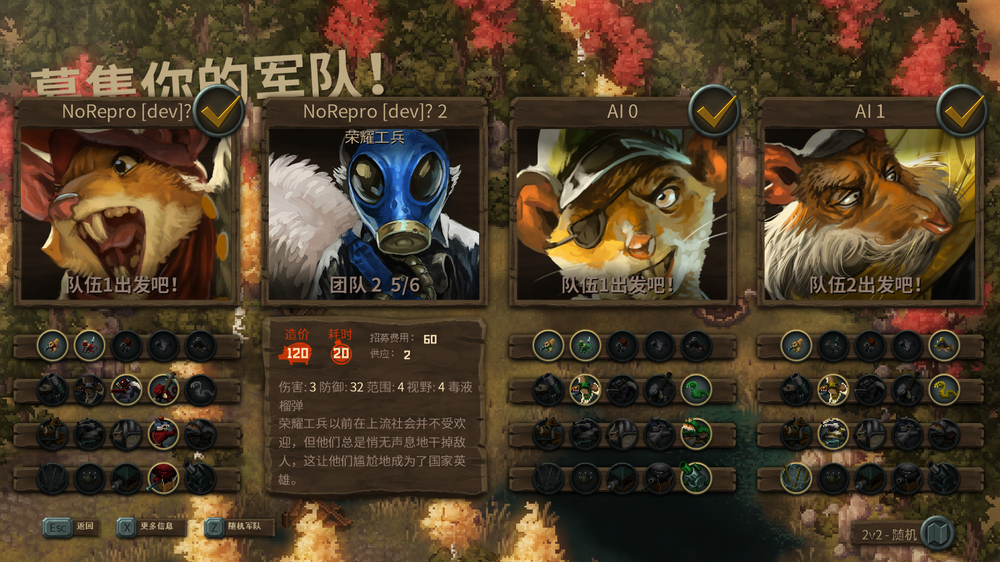
> 大军所向披靡，你将率领喷射火焰的野猪，释放芥子毒气的臭鼬，还有呕吐伞兵猫头鹰引领一场变革。来自 Monaco：What's Yours is Mine 开发组的最新力作《尾牙》是一款包含单人模式，在线对战，分屏对战，精彩重放等许许多多内容的创新即时战略游戏。
> 
> 建设基地，指挥军队，吞噬敌人！
> 
> **肉之圣战**
> 
> 形形色色的角色统统被卷入一场决定谁做食肉者，而谁沦为刀俎的战争。游戏将通过内容丰富的单人战役演绎充满黑色幽默的鼠族变革史。
> 
> **无尽的可重玩性**
> 
> 过程生成式的地图，佐以丰富的自定义参数，每一次的对局都会带给你独特的体验，玩家必须靠谋略而非背板来取得胜利。
> 
> **即开即玩**
> 
> 每局游戏约为5~12分钟，可以分屏本地双人对战，针对手柄和键鼠都进行了充分的优化， 《尾牙》是一款能令新人和老手都满意的爆米花式即时战略游戏。

## 亮晶晶：闪闪王国
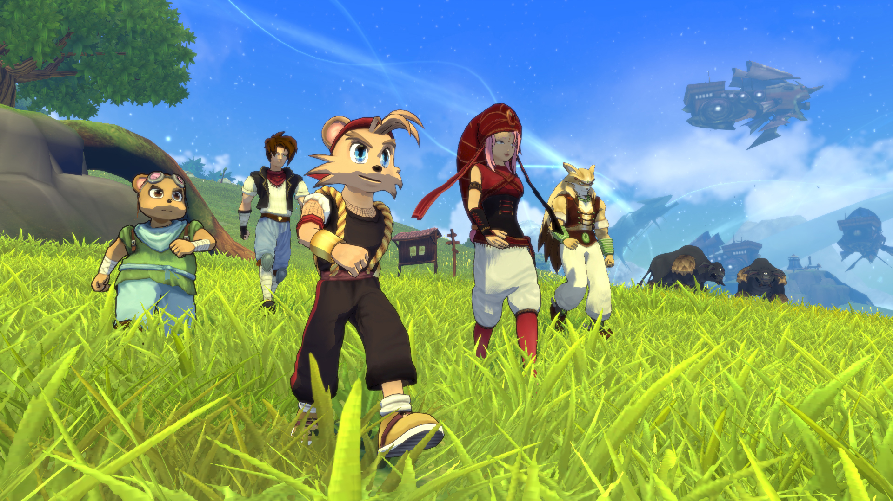
> Shiness is an Action-RPG developed by indie development studio Enigami, which will let you travel in a captivating universe doomed to destruction ever since the fragmentation of the planet Mahera...

## 林中之夜
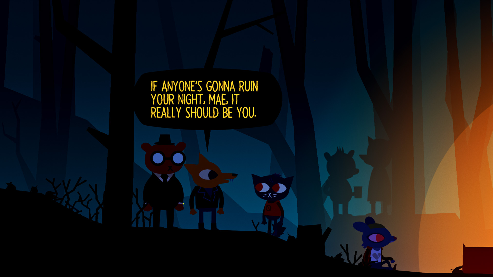
> NIGHT IN THE WOODS is an adventure game focused on exploration, story, and character, featuring dozens of characters to meet and lots to do across a lush, vibrant world.

## 鳞翼天使
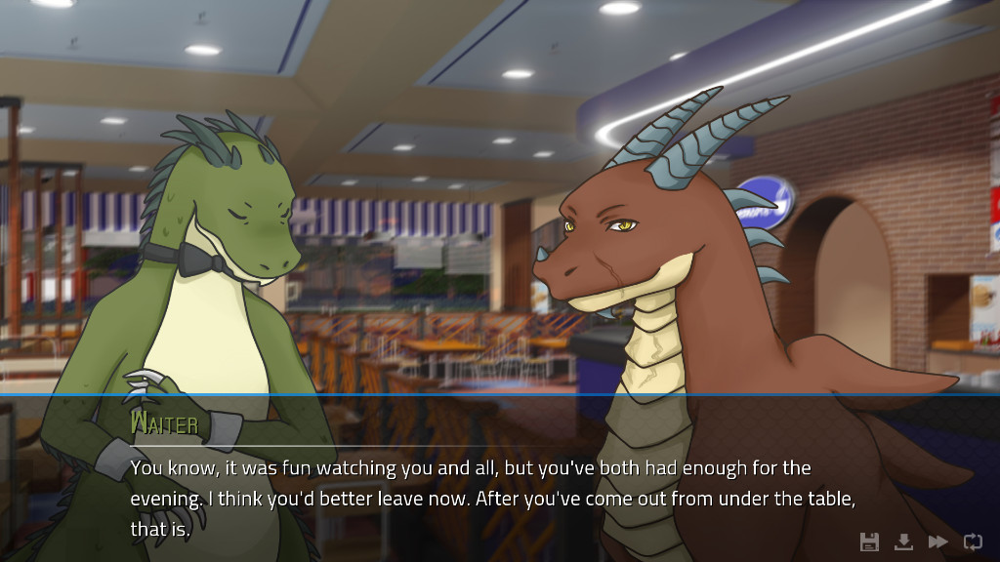
> You, the player, are an ambassador for Earth sent through a mysterious portal into the world of dragons. Explore a town full of secrets and the people who keep them in this compelling sci-fi visual novel with slice of life and dating sim elements.

## 大调小调完整版
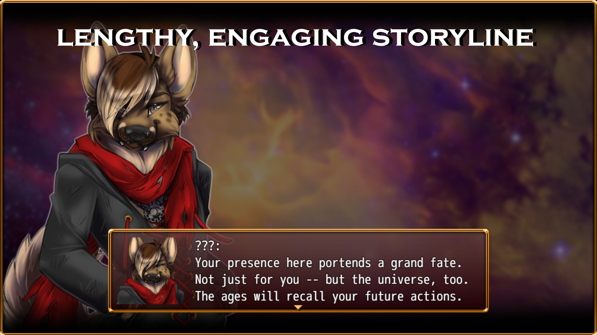
> A highly engaging visual novel, with memorable characters and multiple endings. Traverse worlds, solve a murder mystery -- and partake in political revolution. Inspired by greats such as Steins;Gate, Tales of Symphonia, Persona 4 and Future Diary. An unforgettable science-fiction/fantasy adventure!

## 传说：命运之路
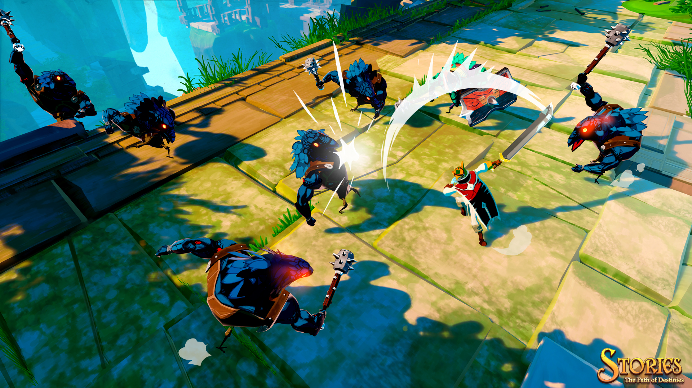
> Stories: The Path of Destinies is an Action RPG, an enchanted storybook filled with madcap fantasy tales, each told by a zippy narrator attuned to the player’s choices and actions.

## 阿门罗
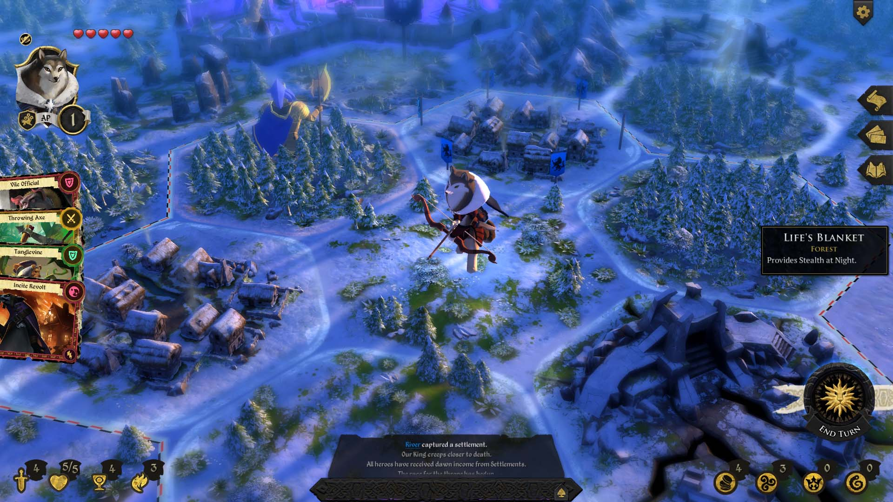
> 《阿门罗》将富有深度的卡牌战术游戏，策略性丰富的桌面游戏，以及角色扮演游戏三种风格融为一体，让玩家体验华丽盛大的冒险之旅。 
> 
> 您将扮演阿门罗一个家族的勇士，在王国里寻找、策划、探索、雇佣特工、击败怪物、施展法术，并与其他玩家展开对抗，为完成终极目标：攻入宫殿，成为阿门罗的统治者而奋斗。阿门罗王国无比美丽又危机四伏，随处都可能有灾祸和强盗藏身。除此之外，更有一种称为“腐化”灾难四处蔓延，王国中的生物无一幸免。

## 凯之传奇
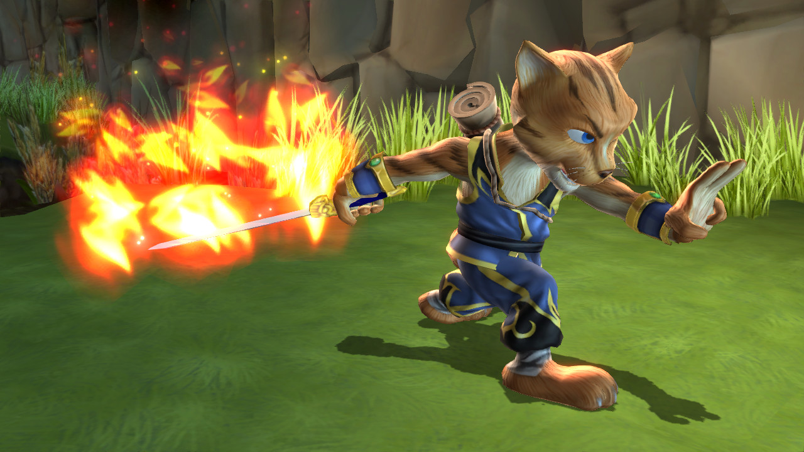
> 10 years after its initial release, Legend of Kay - Anniversary is a thoroughly remastered version of the original game: high-resolution textures; new, more detailed character models; modern rendering techniques and crystal-clear surround sound give this great classic a new shine.

## FaceRig
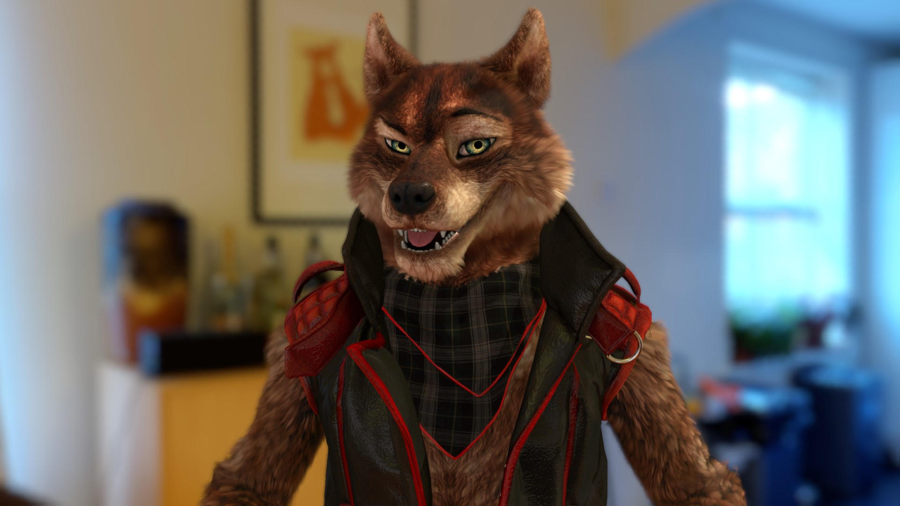
> FaceRig is a program that aims to enable anyone with a webcam to digitally embody awesome characters. The output can be recorded as a movie or streamed to Skype, Twitch, Hangouts or any service that traditionally uses a webcam in real time.
