# PC游戏
游戏名称  | 游戏类型  | 语言 | 发行日期 | 成人 | 介绍 | 获取方式
:-------------: | :-------------: | :-------------: | :-------------: | :-------------: | :-------------: | :-------------:
形骸骑士 | 平台动作 | 中文 | TBA  | 无 | [🐾](#形骸骑士) | Steam 商店
罗曼圣诞探案集 | 文字冒险 | 中文 | TBA  | 无 | [🐾](#罗曼圣诞探案集) | [Steam 商店](https://store.steampowered.com/app/926340/Romans_Christmas/)
履云录 | 战棋 | 中文 | TBA  | TBC | [🐾](#履云录) | TBA
佚失的终章 | 视觉小说 | 中文 | TBA  | TBC | N/A | TBA
煦风新笺 | 视觉小说 | 中文 | TBA  | TBC | N/A | N/A
心之符 | 角色扮演 | 中文 | TBA  | 包含 | [🐾](#心之符) | [官网](http://notesofhearts.com/index_cn.html#anchor5)
厷雏 | 视觉小说 | 中文 | TBA  | TBC | N/A | TBA
围炉之礁湖 重制版  | 视觉小说 | 中文 | 2019年12月  | 补丁 | N/A | Steam 商店
阁楼之礁湖 重制版  | 视觉小说 | 中文 | 2019年9月  | 补丁 | N/A | Steam 商店
Kemo Coliseum  | 角色扮演 | 英/日 | TBA  | 包含 | [🐾](#Kemo-Coliseum) | [Patreon](https://www.patreon.com/kemocoliseum)
Reprise | 音游 | 日文 | TBA  | 无 | [🐾](#Reprise) | [FANBOX](https://www.pixiv.net/fanbox/creator/16301547)
Backbone | 文字冒险 | 英文 | 2020年  | 无 | [🐾](#Backbone) | [Steam 商店](https://store.steampowered.com/app/865610/Backbone/)
TUNIC | 动作 | 英文 | TBA  | 无 | [🐾](#TUNIC) | [Steam 商店](https://store.steampowered.com/app/553420/TUNIC/)
生化变种 | 角色扮演 | 英文 | 2019年  | 无 | [🐾](#生化变种) | [Steam 商店](https://store.steampowered.com/app/597820/BIOMUTANT/)
厄运七人组 | 恐怖 | 中文 | TBA  | 无 | [🐾](#厄运七人组) | [Steam 商店](https://store.steampowered.com/app/579120/Unlucky_Seven/)
阿努比斯与湮没之骨 | 类银河战士恶魔城 | 英文 | TBA  | 无 | [🐾](#Anubis-And-The-Buried-Bone) | [itch.io](https://harmarist.itch.io/anubis)
After Class | 视觉小说 | 英文 | TBA  | 包含 | [🐾](#After-Class) | [itch.io](https://andehp.itch.io/afterclass)
咱的夏天 返乡版  | 视觉小说 | 英文 | TBA  | 包含 | [🐾](#咱的夏天-返乡版) | [itch.io](https://stormsingerstudios.itch.io/homecoming-morenatsu-revisited)
Echo | 视觉小说 | 英文 | TBA  | 包含 | [🐾](#Echo) | [Patreon](https://www.patreon.com/EchoGame)
Adastra | 视觉小说 | 英文 | TBA  | 包含 | [🐾](#Adastra) | [Patreon](https://www.patreon.com/EchoGame)
课外活动 | 视觉小说 | 英文 | 2019年4月1日  | 包含 | [🐾](#课外活动) | [itch.io](https://dynewulf.itch.io/extracurricular-activities)
Lovers of Aether | 视觉小说 | 英文 | 2019年4月1日  | 无 | [🐾](#Lovers-of-Aether) | [Steam 商店](https://store.steampowered.com/app/1043180/Lovers_of_Aether/)
揭谛 | 文字冒险 | 中文 | 2019年2月10日  | 无 | [🐾](#揭谛) | [百度贴吧](https://tieba.baidu.com/p/6055204414)
暗黑之门 | 视觉小说 | [汉化](https://weibo.com/5587914091/GDjHQuWhT) | 2019年2月10日  | 包含 | [🐾](#暗黑之门) | [Patreon](https://www.patreon.com/blackgategame)
Notes from the Cape | 视觉小说 | 英文 | 2019年1月16日  | 包含 | [🐾](#Notes-from-the-Cape) | [itch.io](https://artdecade.itch.io/notesseason1)
超级动物大逃杀 | 射击生存 | 中文 | 2018年12月12日  | 无 | [🐾](#超级动物大逃杀) | [Steam 商店](https://store.steampowered.com/app/843380/Super_Animal_Royale/)
绿叶之冠 | 视觉小说 | 英文 | 2018年11月27日  | 无 | [🐾](#绿叶之冠) | [Steam 商店](https://store.steampowered.com/app/604330/The_Crown_of_Leaves/)
喵喵战争 | 卡牌 | 中文 | 2018年8月8日  | 无 | [🐾](#喵喵战争) | [Steam 商店](https://store.steampowered.com/app/762110/Meow_Wars_Card_Battle/)
秘密之礁湖 重制版  | 视觉小说 | 中文 | 2018年7月6日  | [补丁](http://www.kaiju09.com/lagoonloungeEnglish/) | [🐾](#秘密之礁湖-重制版) | [Steam 商店](https://store.steampowered.com/app/857690/Lagoon_Lounge__The_Poisonous_Fountain/)
咱的夏天 重制版  | 视觉小说 | [汉化WiP](https://weibo.com/5855556803/H9XVcA95K) | 2018年6月20日  | 包含 | [🐾](#咱的夏天-重制版) | [Fur Affinity](https://www.furaffinity.net/view/27724241/)
Just, Bearly | 模拟 | 英文 | 2018年5月31日  | 无 | [🐾](#Just-Bearly) | [Steam 商店](https://store.steampowered.com/app/792030/Just_Bearly/)
Willy Bear Beach 2 | 视觉小说 | 英文 | 2018年5月17日  | 包含 | [🐾](#Willy-Bear-Beach-2) | [itch.io](https://artdecade.itch.io/willy-bear-beach-2)
Omensight | 动作 | 中文 | 2018年5月16日  | 无 | [🐾](#Omensight) | [Steam 商店](https://store.steampowered.com/app/455820/Omensight_Definitive_Edition/)
Amorous | 视觉小说 | 英文 | 2018年4月14日  | 包含 | [🐾](#Amorous) | [Steam 商店](https://store.steampowered.com/app/778700/Amorous/)
Changed | 解谜 | 中文 | 2018年4月5日  | 无 | [🐾](#Changed) | [Steam 商店](https://store.steampowered.com/app/814540/Changed/)
The Pirate's Fate | 视觉小说 | 英文 | 2018年3月27日  | 无 | [🐾](#The-Pirates-Fate) | [Steam 商店](https://store.steampowered.com/app/553480/The_Pirates_Fate/)
Winds of Change | 视觉小说 | 英文 | 2018年3月22日  | 无 | [🐾](#Winds-of-Change) | [Steam 商店](https://store.steampowered.com/app/594130/Winds_of_Change/)
兽祭~吸血鬼之夜 | 角色扮演 | 中文 | 2018年2月11日  | 无 | [🐾](#兽祭吸血鬼之夜) | [百度贴吧](https://tieba.baidu.com/p/5548778877)
家有大猫  | 视觉小说 | 中文 | 2017年11月13日  | [补丁](https://store.nekojishi.tw/zh/product/nekojishi_limited/) | [🐾](#家有大猫) | [Steam 商店](https://store.steampowered.com/app/570840/_Nekojishi/)
雄兽岛的秘密 | 视觉小说 | 日文 | 2017年10月25日  | 包含 | [🐾](#雄兽岛的秘密) | [DLSITE](https://www.dlsite.com/bl/work/=/product_id/RJ210651.html)
尾牙 | 策略 | 中文 | 2017年9月13日  | 无 | [🐾](#尾牙) | [Steam 商店](https://store.steampowered.com/app/286000/Tooth_and_Tail/)
亮晶晶：闪闪王国 | 动作角色扮演 | 英文 | 2017年4月18日  | 无 | [🐾](#亮晶晶闪闪王国) | [Steam 商店](https://store.steampowered.com/app/366640/Shiness_The_Lightning_Kingdom/)
以太之战 | 格斗 | 英文 | 2017年3月29日  | 无 | [🐾](#以太之战) | [Steam 商店](https://store.steampowered.com/app/383980/Rivals_of_Aether/)
林中之夜 | 文字冒险 | 英文 | 2017年2月21日  | 无 | [🐾](#林中之夜) | [Steam 商店](https://store.steampowered.com/app/481510/Night_in_the_Woods/)
鳞翼天使 | 视觉小说 | [汉化](https://steamcommunity.com/sharedfiles/filedetails/?id=1631230813) | 2017年2月1日  | 无 | [🐾](#鳞翼天使) | [Steam 商店](https://store.steampowered.com/app/571880/Angels_with_Scaly_Wings/)
大调小调完整版 | 视觉小说 | 英文 | 2016年10月11日  | 无 | [🐾](#大调小调完整版) | [Steam 商店](https://store.steampowered.com/app/475490/MajorMinor__Complete_Edition/)
Orekemo | 视觉小说 | [汉化](https://pan.baidu.com/s/1-o6N8xe4-AVoj7bKDM_l0g) 1xzs | 2016年9月25日  | 包含 | [🐾](#你看见过我的野兽吗) | [DIGIKET](http://www.digiket.com/work/show/_data/ID=ITM0144580/)
Great Troubles | 视觉小说 | 英文 | 2016年6月28日  | 包含 | [🐾](#Great-Troubles) | [Fur Affinity](https://www.furaffinity.net/view/20409644/)
Rack 2:Furry Science | 模拟经营 | 英文 | 2016年5月30日  | 包含 | [🐾](#Rack-2:Furry-Science) | [Pateron](https://www.patreon.com/fek)
传说：命运之路 | 动作角色扮演 | [汉化](https://steamcn.com/t429856-1-1) | 2016年4月12日  | 无 | [🐾](#传说命运之路) | [Steam 商店](https://store.steampowered.com/app/439190/Stories_The_Path_of_Destinies/)
Mugen Delga Action | 动作 | 英文 | 2015年11月28日  | 包含 | [🐾](#Mugen-Delga-Action) | [YouTube](https://www.youtube.com/watch?v=ZjDZ4h6eLvo)（失效）
阿门罗 | 卡牌策略 | 中文 | 2015年9月2日  | 无 | [🐾](#阿门罗) | [Steam 商店](https://store.steampowered.com/app/290340/Armello/)
蛮荒兽族 | 文字冒险 | 中文 | 2015年8月16日  | 无 | [🐾](#蛮荒兽族) | [橙光](https://www.66rpg.com/game/356881)
笨蛋部 | 视觉小说 | [汉化](https://tieba.baidu.com/p/4944731151) | 2015年8月16日  | 包含 | [🐾](#笨蛋部) | [BOOTH](https://booth.pm/ja/items/526423)
凯之传奇 | 角色扮演 | 英文 | 2015年7月28日  | 无 | [🐾](#凯之传奇) | [Steam 商店](https://store.steampowered.com/app/313810/Legend_of_Kay_Anniversary/)
FaceRig | 视频软件 | 中文 | 2015年7月7日  | 无 | [🐾](#FaceRig) | [Steam 商店](https://store.steampowered.com/app/274920/FaceRig/)
彼时的约定 | 视觉小说 | 中文 | 2015年4月7日  | 无 | [🐾](#彼时的约定) | [百度贴吧](https://tieba.baidu.com/p/3686346007)
Willy Bear Beach | 视觉小说 | 英文 | 2015年3月6日  | 包含 | [🐾](#Willy-Bear-Beach) | [itch.io](https://artdecade.itch.io/willy-bear-beach)
Another Bookmark | 视觉小说 | 中文 | 2014年10月12日  | 无 | [🐾](#Another-Bookmark) | [百度贴吧](https://tieba.baidu.com/p/3345903293)
愛する君へ | 视觉小说 | [汉化](https://tieba.baidu.com/p/4807261773) | 2014年5月11日  | 包含 | [🐾](#愛する君へ) | [Pixiv](https://www.pixiv.net/member_illust.php?mode=medium&illust_id=43445593)
ケモノ戦士の夜這い | 模拟 | 日文 | 2013年5月25日  | 包含 | [🐾](#ケモノ戦士の夜這い) | [DIGIKET](https://www.digiket.com/work/show/_data/ID=ITM0082832/)
Dust: An Elysian Tail | 类银河战士恶魔城 | [汉化](https://www.codebay.in/2016/06/dustaet-cht-mod.html) | 2013年5月24日  | 无 | [🐾](#Dust-An-Elysian-Tail) | [Steam 商店](https://store.steampowered.com/app/236090/Dust_An_Elysian_Tail/)
ゾウの引越屋さん | 视觉小说 | 日文 | 2012年5月3日  | 包含 | [🐾](#ゾウの引越屋さん) | [BOOTH](https://booth.pm/ja/items/89534)
Mugen Delga | 动作 | 英文 | 2010年8月16日  | 包含 | [🐾](#Mugen-Delga) | [主页](http://bomb-lion.blogspot.com/2011/08/mugen-delgav10.html)（失效）
Hello, 吳鍊 | 模拟 | 中文 | 2010年12月29日  | 无 | [🐾](#Hello-吳鍊) | [主页](https://zoharwolf.weebly.com/hello-2155537706.html)（失效）
咱的夏天。 | 视觉小说 | [汉化版](https://tieba.baidu.com/p/3452271872) | 2010年8月15日  | 包含 | [🐾](#咱的夏天) | 已解散
Blank Blood Delga | 动作 | 中文 | 2010年4月21日  | 包含 | [🐾](#Blank-Blood-Delga) | [主页](http://dragon-artwork-collection.blogspot.com/2010/04/blank-blood-delga-version-release.html)（失效）
Escape 逃 | 视觉小说 | 中文 | 2010年2月22日  | 包含 | [🐾](#Escape-逃) | [主页](https://zoharwolf.weebly.com/escape-36867.html)（失效）
Kemono Code | 视觉小说 | 中文 | 2009年8月13日  | 包含 | [🐾](#Kemono-Code) | [主页](https://zoharwolf.weebly.com/kemono-code-37324.html)（失效）

# 非PC游戏

游戏名称  | 游戏类型
:-------------: | :-------------:
星际火狐 | 射击
天空机器人 | 动作角色扮演
ちくたくコンチェルト | 音游

# 详细介绍

## 形骸骑士

> 神秘的瘟疫，突然降临在古老的塞勒菲斯，当白虎双子深陷其中，他们将如何选择？
> 
> 在这无限的轮回中探寻，甚至利用银匙的力量改变过去，最终要如何找到埋藏在这个疯狂的世界之下的答案？
> 
> 《形骸骑士》是一款平台动作Roguelite游戏，拥有丰富的剧情体验，并且全部使用经典的手绘2D风格绘制。

官方微博：[Kelipot形骸骑士](https://www.weibo.com/kelipot)

## 罗曼圣诞探案集

> 又是一年圣诞，狼人侦探罗曼打算在酒馆好好度过一个没有案件缠身的假期。
> 
> **扮演罗曼解决酒馆内的谜题**
> 
> 因为暴雪的缘故，13 位性格各异的旅客被困在酒馆里，表面平静的酒馆随时会爆发深埋多年的积怨。准备好应对旅客之间的明争暗斗，帮助旅馆老板解决酒馆里的疑案。
> 
> **体验*垩坡利恩*的风土人情**
> 
> 太阳底下无新事，但是在太阳之国*垩坡利恩*却不同。这个有着许多种族兽人的国度与人类世界有诸多不同，而酒馆正是风俗习惯的聚集地。在没有凶杀案的闲暇时光里，多跟酒客交流吧。
> 
> **达成多种结局**
> 
> 随着你的每个选择，你的未来会被导向不同的境遇。如果拥有回溯时间的能力，也许能让大家愉快地度过一个圣诞假日？
> 
> **本游戏含轻微血腥内容**（我也没办法去掉毕竟这是个天杀的侦探游戏）

官方微博：[罗曼圣诞探案集](https://weibo.com/u/5903993211)

## 履云录
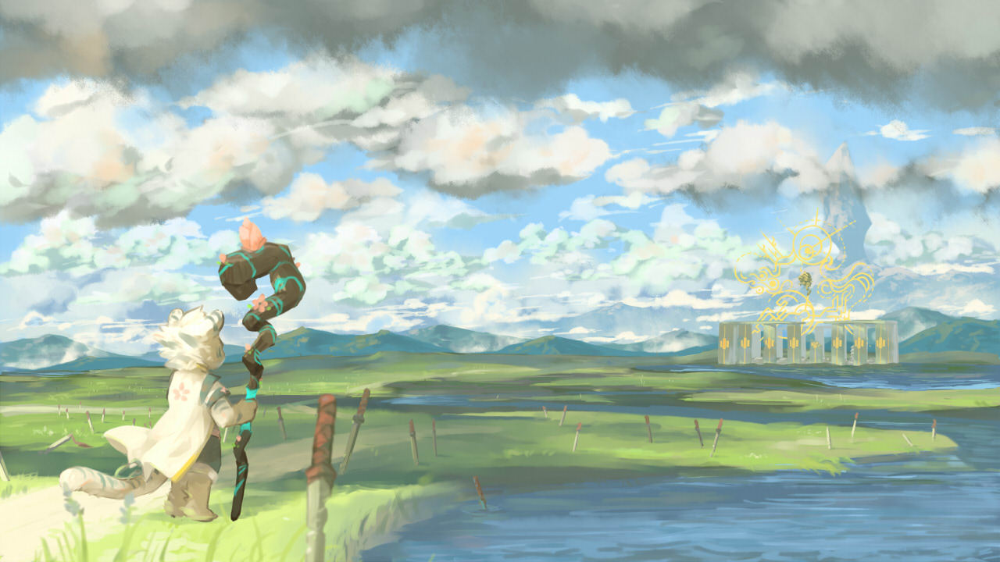
> 通过剧情、地图探索可以：
> 
> * 学习更多绝招！
> * 开启友情联协攻击系统
> * 强化现有角色属性
> * 获得新的装备品
> 
> 通过城市重建和开发系统可以：
> 
> * 拓展地图探索范围
> * 看到更多八卦
> * 随时和常驻城市的居民闲聊
> * 影响和改变结局（诶？）
> 
> 战斗系统中：
> 
> * 可以操作决明发动大轰斩
> * 可以让东玄点燃草地获取招式威力加成
> * 可以让光元祈雨灭火
> * 可以命令消云守卫自己提供无微不至的保护
> * 可以使用已解锁的双人合击技能，发动华丽必杀
> * 更多更多

官方微博：[履云录](https://weibo.com/lvyunlu)

## 佚失的终章

> 「佚失的终章」是由风旅社所企划的一款剧情+养成的文字游戏。
> 
> 主要讲述了主角在大学最后一年所发生的种种事情。
> 
> 咖啡厅，音乐会，温泉等一系列充满未知的大四生活等你来探索！
> 
> 玩家可在游戏里体验一个完整的以兽人为主角的故事。
> 
> 游戏内拥有极多的剧情变化，每个人都将会体验到属于自己的故事。

官方微博：[WindGo风旅社](https://weibo.com/u/6343557679)

## 煦风新笺

官方微博：[煦风新笺官博](https://weibo.com/u/5857154820)

## 心之符
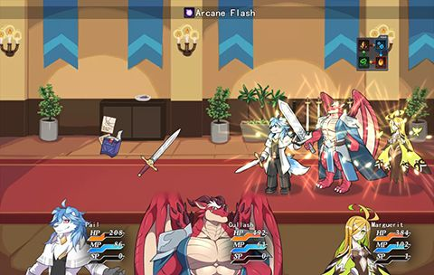

> 《Notes of Hearts》是一款研发中的PC和Mac平台游戏。游戏核心玩法结合了JRPG和恋爱模拟元素，战斗系统则采用3v3团队回合制的情景战斗模式。
> 
> 游戏的剧情一共分成6个章节，玩家在剧情里将时刻做出选择，而这些选择将会对剧情的走向产生重要影响。随着章节的推进，冒险的世界会越来越广阔，众多性格鲜明的角色也将陆续登场。
> 
> 玩家身为游戏的主人公，在游戏开始时可以自定义喜欢的性别和种族。本游戏支持同性恋爱，所以所选的性别并不会对游戏体验造成影响！

官方微博：[NotesofHearts_心之符](https://weibo.com/u/6404918537)

## 厷雏

官方微博：[HinaKageDogs](https://weibo.com/u/3868792778)

## 围炉之礁湖 重制版

## 阁楼之礁湖 重制版

## Kemo Coliseum
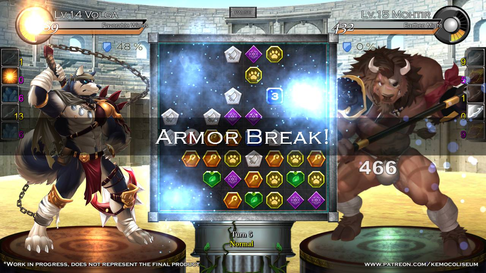
> Kemo Coliseum is an adult puzzle RPG game. Players will take a role of one of the heroes and participate in the tournament in the Kingdom of Kornelia. The winner of the tournament will be rewarded with a title of a "Gladiator", and a chance ask one wish to be granted by the king of Kornelia.
> 
> The game is a mix of a match-3 puzzle game with RPG elements. Matching three or more gems of the same type to erase them from the board. Each gem type will result in different action, ranging from a physical attack to charging your skills. Fans of [PuzzleQuest](http://store.steampowered.com/app/12500/) will get a hang of the game very quickly, but even if you have never played PuzzleQuest before, the game is very easy to learn. 
> 
> While the goal of the game is to win the tournament, there are many things for you to do before you continue to the next round. Helping people in the town by completing quests, finding rare items and improve your skill by exploring the dungeons, or build relationship with other contestants. 
> 
> Kemo Coliseum will be freely available on OSX and Windows once it's finished. 
> 
> ケモコロシアムはアダルトパズルRPGです。プレイヤーはキャラクターを一人選んで、コーネリア王国のトーナメントに出場します。優勝者は「剣闘士」の称号を得ると共にコーネリア王から願い事を叶えてもらえます。
> 
> ゲームプレイはマッチ３パズルにRPG要素を足したものです。画面中心に盤上があり、たくさんの色のジェムが並んでいます。そのジェムを３つ以上揃えることで敵に対して様々な行動を起こします。「パズルクエスト」を遊んだことがあるなら分かりやすいでしょう。パズルクエストを未プレイの方でも簡単に遊べますよ。
> 
> ゲームの目的はトーナメントで優勝することですが、他にもたくさん遊べる要素があります。街の人をクエストで助けたり、貴重なアイテムを探したり、ダンジョンを探索してスキルを磨いたり、他のトーナメント出場者と関係を深めることもできます。
> 
> ケモコロシアムは Mac OSX と Windows で、フリーで公開される予定です。

## Reprise
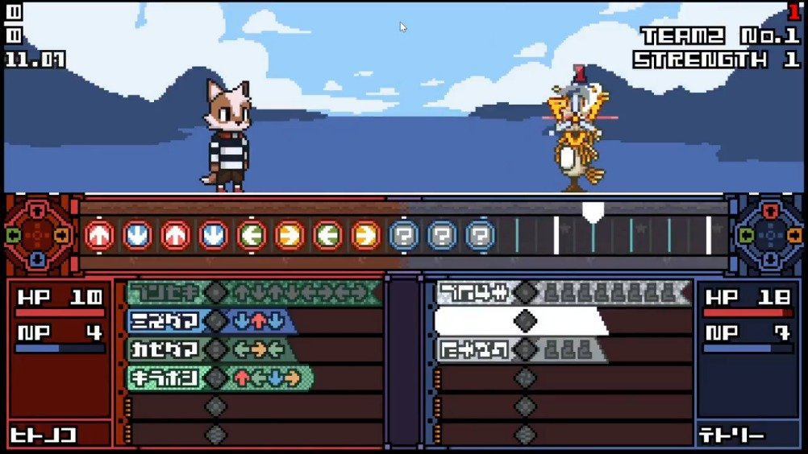

玩法预览：[微博视频](https://weibo.com/tv/v/HkrPqgXJG?fid=1034:4348735220820516)

## Backbone

> Backbone is a noir-inspired detective adventure. As raccoon private eye Howard Lotor, sniff out clues, collect evidence, interrogate witnesses, and explore beautiful pixel art version of dystopian Vancouver, BC.
> 
> Howard Lotor is smart, self-assured and set in his ways. Caught in the tedium of day-to-day life, he’s resigned to the abuses of the authoritative regime in power and compliant with the systemic inequality that permeates society. But a string of cases that grow progressively more outlandish will put his worldview to the test. 
> 
> Backbone's gameplay is a new take on point-and-click adventure, featuring stealth, exploration, and extensive branching dialogues inspired by classic CRPGs. As Howard, you must traverse the diverse districts of a now walled-off Vancouver, sniff out clues, collect evidence, interrogate witnesses, and choose which leads to follow. 
> 
> Inspired by film noir, Backbone will submerge you into its dark dystopian atmosphere. Every animation in the game is handcrafted frame by frame, and environments are modeled after real streets of Vancouver, BC. The breathtaking combination of high resolution pixel art and 3D effects like dynamic lighting, pouring rain, volumetric fog and neon lights bring the sprawling city to life. Original doom jazz soundtrack will keep you on the edge with the enveloping veil of bebop and cinematic soundscapes, where every sound tells a story.

## TUNIC

> TUNIC is an action adventure about a tiny fox in a big world. Explore the wilderness, discover spooky ruins, and fight terrible creatures from long ago.

## 生化变种

> BIOMUTANT is an open-world, post-apocalyptic Kung-Fu fable RPG, with a unique martial arts styled combat system allowing you to mix melee, shooting and mutant ability action.
> 
> A plague is ruining the land and the Tree-of-Life is bleeding death from its roots. The Tribes stand divided. Explore a world in turmoil and define its fate – will you be its saviour or lead it to an even darker destiny?

## 厄运七人组

> 《厄运七人组》将会带您来一场太空漫步，并体验一个爱恨交集，与渴望人肉的故事。
> 
> 艾伦的朋友们总是喜欢庆祝特别场合，他们错过了匿名戒酒会，跑去参加了一个豪华汽车旅馆的生日派对。不幸的是，派对的主人因为吃了一口美味的人肝香肠而食欲大增。他们的庆生派对即将成为死亡派对...
> 
> 在这个美丽的像素写实风世界中尽情冒险！你所做的每一个选择都将决定你朋友们的命运。探索参与者们的动机与欲望，并破坏他们的阴谋吧！

## Anubis And The Buried Bone
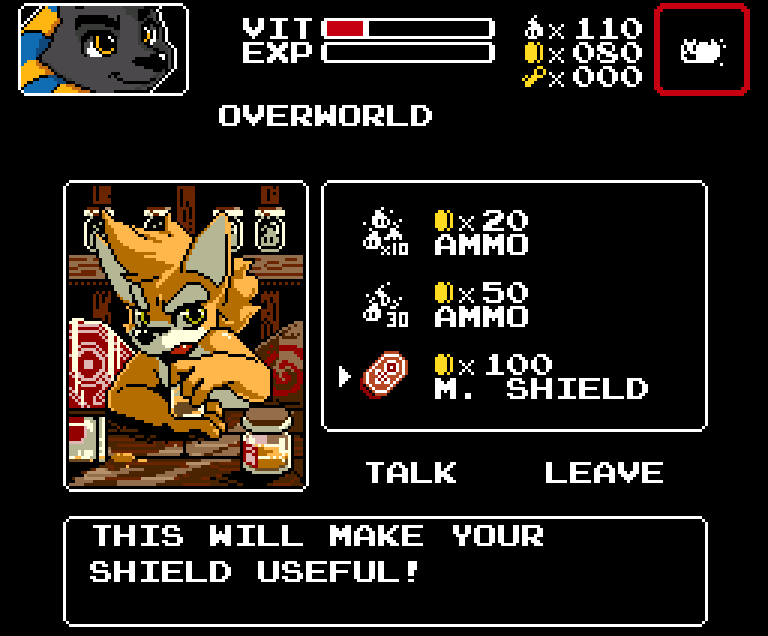
> Explore an egyptian themed authentic retro action-adventure platformer.
> 
> Powerful souls have escaped Anubis's clutches, so he has to hunt them down, enhancing his abilities along the way by discovering numerous items and unlocking secrets. In the style of classic 8-bit action-adventure games, Anubis and the Buried Bone offers an open world that you decide how to conquer. Be wary, though, because Anubis's difficulty is as authentic as its graphics! Scour the world for its secrets and gain the advantage over your enemies, enhancing Anubis's abilities with dozens of unique treasures.

## After Class
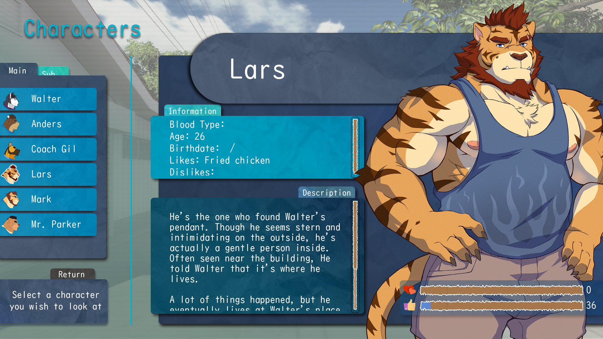
> After Class is an NSFW, gay, furry visual novel focused on the relationship between the main character (you) and the people you meet. Depending on your choices, you might learn something about them and even end up romancing one of them as the story progresses. Every choice you make has its consequences and it'll change the outcome of the story! 
> 
> You just moved to the city for a fresh start. It's your first day of college and you don't know anyone in the city. As you attend school, you met a bunch of new people. Some of them are nice, some of them are weird, some of them had a troubled past and so on. 
> 
> You make friends with them easily and quickly grow close to them. As you get closer with them, they start to open up to you and slowly show their other side that most people don't know. For some reason, a forgotten dream resurfaces after you meet them. Does it have anything to do with the people you met or is it only a coincidence?

## 咱的夏天 返乡版
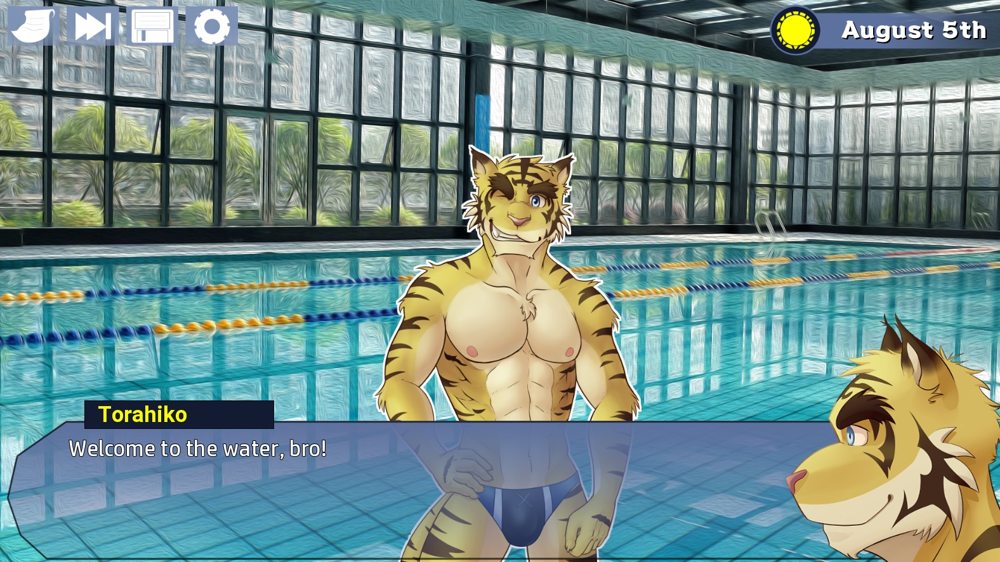
> In Homecoming, you take on the role of a young Japanese snow fox named Hiroyuki Nishimura. After moving away from your hometown Minasato to Osaka five years ago, you receive an unexpected letter from an old friend inviting you back for one last summer vacation before starting your senior year of high school. What complicates things is how you've neglected to contact any of your friends over the years. Although nervous, you accept the invitation.
> 
> What awaits you back in Minasato? Will you be welcomed with open arms, or has it been so long that everyone has forgotten about you? Will this be yet another wasted summer, or will you finally have the chance to experience what makes life worth living?

## Echo
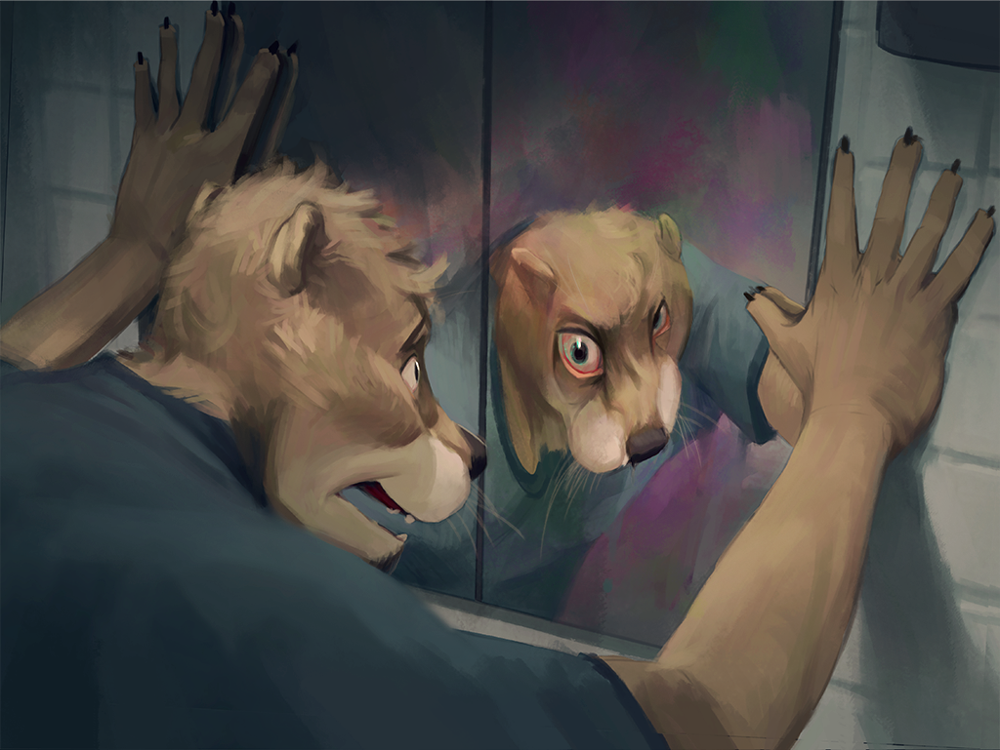
> Echo is a small, isolated, desert town located somewhere in the Southwest. It's seen better days; its businesses closing and population dwindling. 
> 
> During spring break, Chase, a young otter who grew up in Echo, is back for a school project aimed at documenting an event in the 1870's that may have lead to the town's current state. He's joined by five friends, who grew up with him in Echo, taking the chance to have a little reunion. Unfortunately, Chase begins to realize that their memories of Echo may have been a bit rose-tinted. Being back in the town digs up old and painful memories; secrets that lead to rifts in the group that have been boiling under the surface for years. On top of that, Chase begins to realize that Echo itself may have its own secrets. Odd and unexplained memories that he always blamed on an overactive childhood imagination may not have been imagined at all. 
> 
> Finally, an event is triggered that turns these fears into something much more tangible and dangerous. Chase is now forced into a situation in which he must help his friends either face, or escape their demons. Either way, Echo is not keen on letting them go... 

## Adastra
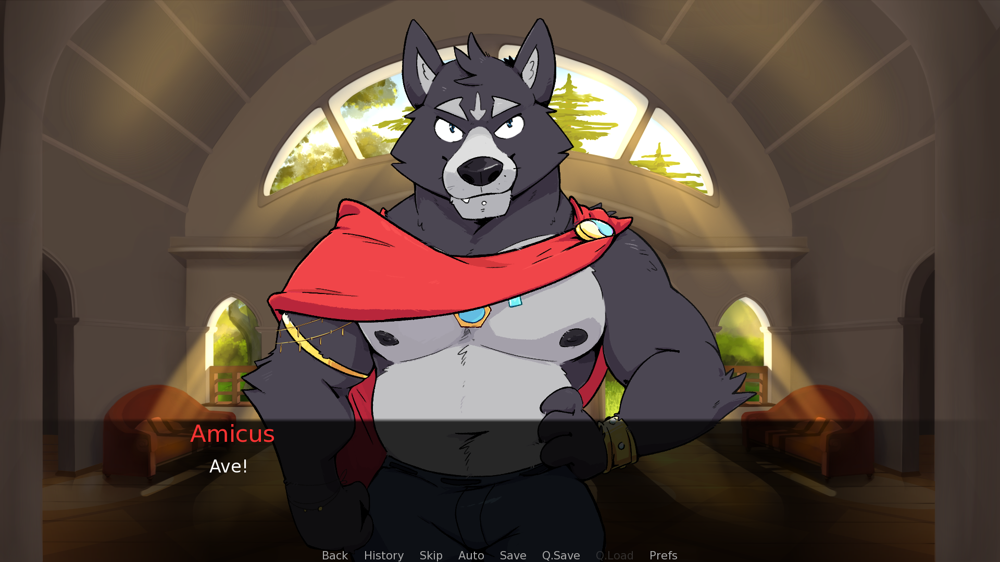
> You're having the time of your life in Rome on a study abroad program when you're suddenly abducted by an alien. What does he want from you? Well, he doesn't seem to want to tell and, before you know it, you're millions of miles away from Earth on your way to a place you know nothing about.
> 
> Adastra is a romance visual novel with a whole bunch of sci-fi and political intrigue mixed in. You'll experience the perils of navigating an empire in turmoil while deciding who you should and who you definitely shouldn't trust. 
> 
> In this climate of turncoats and backstabbers, you start to wonder if the alien that abducted you is the one person you can trust the most. 

## 课外活动
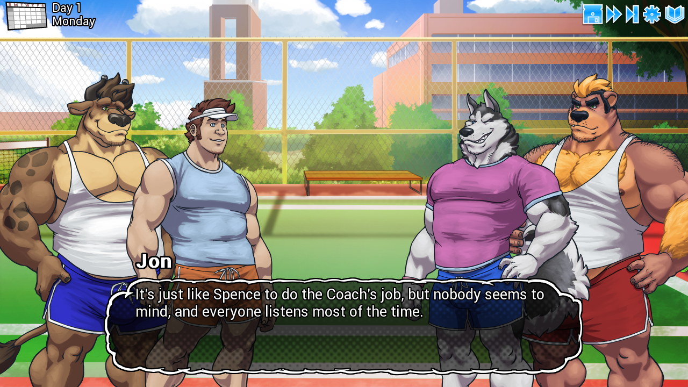
> Extracurricular Activities is a visual novel following the main character (you!) through his endeavor of trying to romance a member of his tennis team. The choices you make can impact the way you teammates react to you, so make your choices carefully.

## Lovers of Aether

> Are you tired of fighting? Lovers of Aether is the game for you! This is a wholesome animal dating simulator set in the world of Rivals of Aether.

## 揭谛
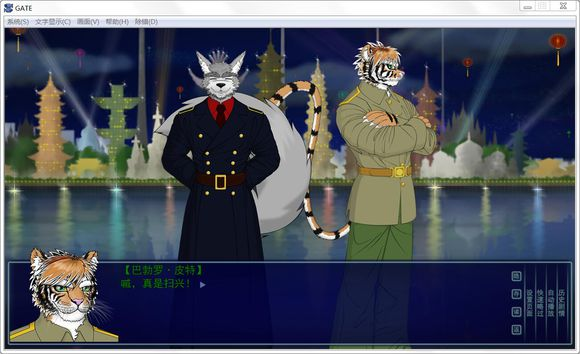
> 从计划、着手制作到现在成品，为期近一年终于将这个独立兽人文字游戏《揭谛》三条主线做出来咯。
> 
> 这部作品确实耗费了我相当大的精力，其中除少量音效来源于网络，里面所有的设定、文字、立绘、背景、CG（包括所有图案和纹理）、音乐都是一个人独立完成，虽然不敢肯定游戏达到及格的标准，但至少能保证是绝对用心制作的。
> 
> 游戏特色上，本作以“中式赛博朋克”为题材，尝试将中国传统文化、科学哲学理论（如AI理论、灵魂理论、唯物理论、量子理论等）、宗教文化（主要是佛教文化）、世界不同的艺术形式进行融合，也希望能丰富“兽人”这一类别所能具备的现实意义和内涵；另外，本作虽以“情感”为线索，但重点还是放在探讨一些包括“情感”在内的更为深入的问题；最后，因同类游戏中不乏情感交流、情色描写元素，所以本作便使用了一种比较另类的方式进行相关描写，全篇没有任何敏感字眼和图片，价值取向整体也算正面，所以我也不好定义是否属于R18。

作者微博：[团购规划局](https://weibo.com/u/6989191897)

## 暗黑之门
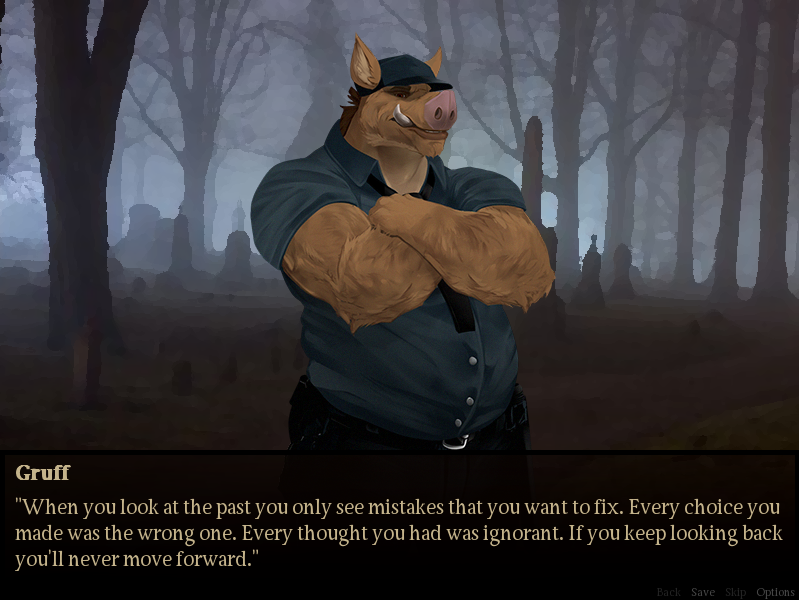
> Welcome to Blackgate, a nonlinear visual novel about a town filled with monsters. The who, what, when, where, why, and how are up to you to figure out.
> 
> Blackgate is a mature visual novel of a mostly M/M nature. While there will be a limited number of scenes of a M/F nature, the game is intended to be mostly M/M. The game also contains elements of horror, violence, and some gore (separate from the sexual scenes). Prepare to hate everyone, and everything.

## Notes from the Cape
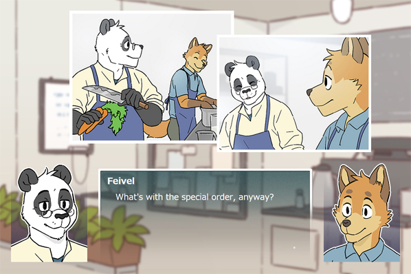
> Notes from the Cape is a visual novella series about the citizens of Cape Bottom Sail, a beach town and tourist destination on a peaceful, idyllic version of Earth. Episodes vary from slice of life, to cute and horny, to sincere and sweet. Expect some adult situations, nudity, and sex. This is an adults only series.
> 
> This package contains all twelve episodes of season 1, which takes place between Willy Bear Beach 1 & Willy Bear Beach 2. It also contains image packs for every episode, except for the pilot.

## 超级动物大逃杀

> **为了生存而战：**
> 
> 超级动物大逃杀是一款创意十足，刺激且充满战略性的上帝视角大逃杀。在各种异域风情的生物群落中参与这场由最多64名可爱杀手动物的尖牙利爪(还有机关枪)大乱斗吧！这里的动物们都为了成为最强狗狗(或最强猫咪、最强树懒...之类的)而战！
> 
> * 以上帝视角在紧张刺激的氛围中享受这款创新的大逃杀体验。
> * 直观的战争迷雾系统让你能够使用潜行来进行战略突袭。
> * 探索这座巨大且美丽的，拥有各式各样的生态群落与一座历经沧桑的超级野生动物园遗迹的天堂岛屿。
> * 砍掉高耸的杂草堆来发现藏在其中的物品，因为对付杂草不必留情。
> 
> **为什么要叫作「超级」试玩版呢?**
> 
> 嗯...除了在每样东西前面加上「超级」会让他更棒以外，这个试玩版同时也让你能尽情游玩完整的在线模式，随便你玩喔！而且你还可以开始记录你的进度，并获得物品与动物DNA。在试玩版中所赚取的物品会暂时被锁定，所以你无法解锁新动物或把他们打扮成你喜欢的样子，但如果你喜欢这款游戏并决定要购买的话，你在试玩版中所获得的所有进度与物品都会直接转移到完整版中！还蛮「超级」的，对吧？只希望试玩版没超级过头反而让你不想购买正式版了，不过我们还是对这款游戏作品与它所建立起的玩家社区感到非常自豪，所以我们认为让你亲自体验游戏的魅力更会让你觉得这是一款值得支持的抢先体验游戏！
> 
> **不断进化与改善的游戏内容：**
> 
> 直观的上帝视角与简单易懂的机制让这款成为了目前最好上手的大逃杀游戏，而对于进阶玩家我们同时也保留了非常具有深度的战略与技术奖励。此外，无论您是在Macbook或是PC上游玩，我们出色的优化都能让你流畅地进行游戏。
> 
> 随着游戏更新，小岛和基因工程超级动物的名单不断（啊咳）进化。您的超级动物可以通过全新的服装、墓碑、死亡爆炸效果、武器和舞蹈动作等进行个性化定制。就算游戏打得菜，皮肤还是可以一套一套买的。
> 
> 加入超级动物世界，一起来看看我们正与抢先体验社区进行着哪些工作，并为游戏的发展做出贡献！

## 绿叶之冠

> Roui, a resilient city dandy, a half-educated jeweler and the author of scientific magic articles, was met with a colossal failure and must return to his homeland Latori.

## 喵喵战争

> Meow Wars是一个猫主题的卡牌战斗游戏，具有极易掌握的机制和迷人的手绘人物。一路争战，战胜每个挑战者，接近 指挥官卡特拉特并从他的铁腕下解放猫岛。每个阶段都会向令人信服的猫科动物故事中引入一只新猫和新的卡牌能力。在PVP对决中挑战您的朋友，或者测试您对抗全球观众的力量。 

## 咱的夏天 重制版
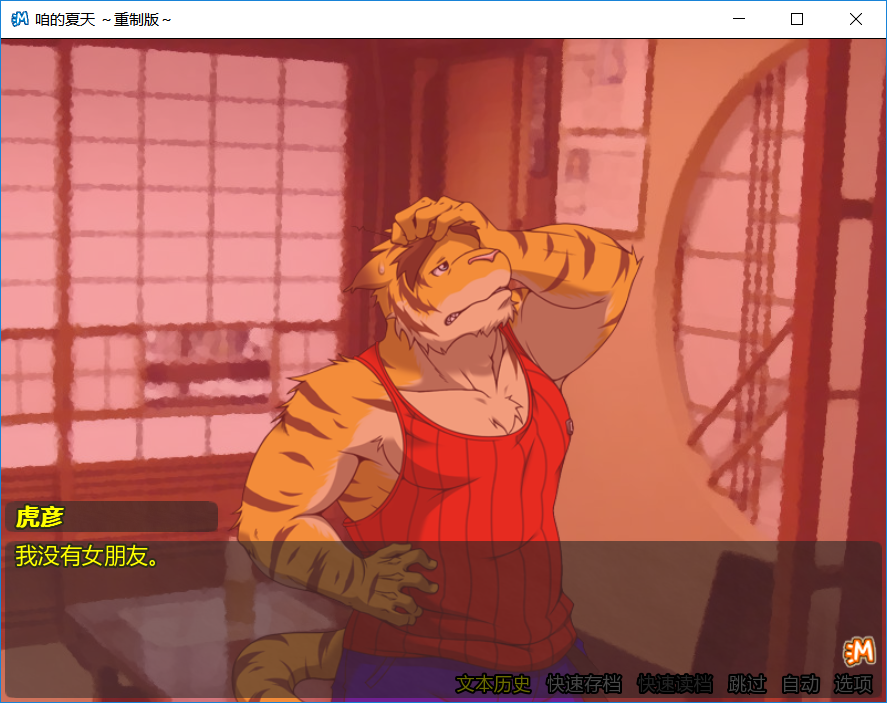
> 1. 重制版是国外大神团队在原版的基础上制作的同人作品，该作的大部分立绘、场景、CG等都秉承了原版的画风，音乐方面引入了一些符合现代元素的电子音乐。
> 2. 重制版与原版最大的不同是剧情内容，重制版在8月15日（原版游戏划分攻略对象的日子）之前加入了很多全新的剧情内容，原作中的9位人物都有了新的剧情。
> 3. 因为是0.5版本，所以该版本只有4条线是完整的：辰树 柔一 深以及新加入的巅。其他6人的剧情只能进行到野营部分，所以呼声最高的虎彦线还是没有（划掉）。
> 4. 重制版也存在着跟原版大体一致的内容，但该版在细节设定上进行了一些相应的改变。
> 5. 游戏中出现了新的面孔，他们也带来了新的剧情，比如：京慈的妹妹智叶，柔一的弟弟坚二，孝之助的父亲兵助（然而都没有立绘）……
> 6. 巅线的触发方式较为特殊，需要玩家在柔一线中触发特定的剧情后才可以进入，为了保证游玩的乐趣性，具体内容还望玩家之后自行探索，在此不多做透露。
> 7. 很可惜，原作中每日在地图界面选择不同地点决定今日活动的环节被修改了，重制版则是简单地让玩家在几个选项中做出抉择。
> 8. 上述提到的另外6人的剧情线很遗憾无法在重制版中游玩，国外大神之后会在“返乡版”中继续制作。

## 秘密之礁湖 重制版

> 这是一部包含兽人角色与同性恋爱主题的视觉小说游戏。你将在游戏内扮演一名兽人角色，搬到湖边的小村子居住，和当地的村民生活在一起。
> 
> **故事剧情**
> 
> 游戏主角是一位兽人，在工作上积劳成疾，不得不选择辞职。为了养伤，他听从老朋友的建议，搬到朋友所住的湖边小村。
> 
> 搬来之前，村子里出现名为“春洲之巨人”的奇怪现象，不时有神秘的巨响和地震。
> 
> 对此好奇的游客大量涌入村子。
> 
> 主角在饭店任职服务员，和他的朋友一起工作。
> 
> 搬家后没多久，主角的朋友向他发出警告。
> 
> 「千万别靠近村里广场中的喷泉。」
> 
> 他很快就会发现，喷泉带来的是什么样的威胁。
> 
> **游戏内容**
> 
> 这部视觉小说游戏包含兽人角色与同性恋爱内容。游戏系统注重提供便利的游戏体验。
> 
> 因此你可以在通关后选择任意章节继续游戏，并做出不同的选择。
> 
> **语言**
> 
> 游戏支持多种语言。在游戏过程中，随时都可以按键切换语言。
> 
> 是学习新语言的好机会。

## Just, Bearly

> An honest comedy about anxiety and feeling awkward, played through painfully relatable mini games.
> 
> A comedic story game played in vignettes, about feeling anxious as a bear in inner city Melbourne, Australia, and trying to connect to people none the less. 
> 
> Click, pull, mash, and guide your way through an ever changing mix of dialogue choices, reaction challenges, dexterity tests, rhythm games and God only knows what else as you overthink and under-perform your way through every day life -- Striving towards greatness and being less of an awkward, anxious, crap.

## Willy Bear Beach 2
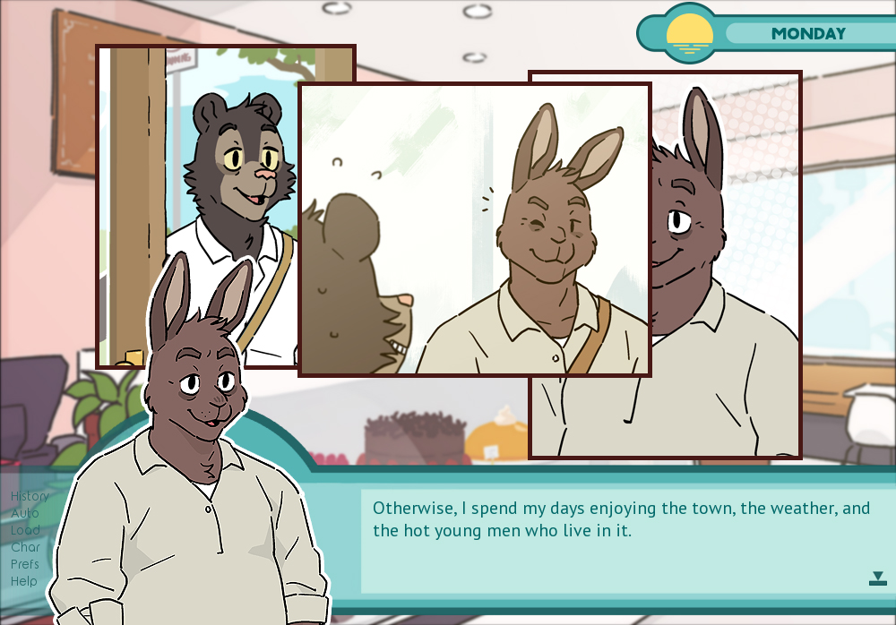
> In the idyllic town of Cape Bottom Sail, Willy the Bear finds himself with a week off and nothing to do. You'll guide him through his time off by visiting the town's various locations, meeting his friends, finding items, and by simply enjoying the peaceful and serene atmosphere of the cape. And if you're lucky, you might just get some action while you're at it.
> 
> Willy Bear Beach 2 is an interactive visual novel featuring an ambient, slice of life story with hundreds of pages of dialogue, including full paths for each of the main characters, complete with unlockable scenes. It is designed to be played through several times. 

## Omensight
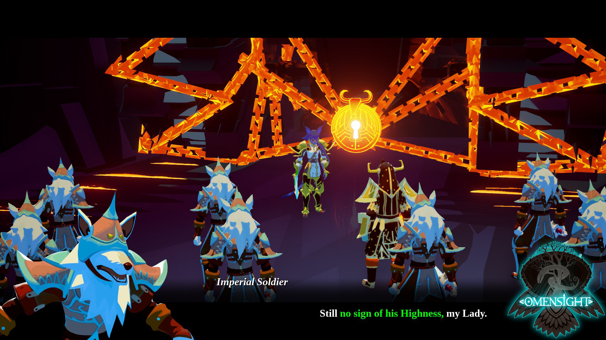
> Omensight是一个动作皆谋杀侦探式游戏。你是先驱者，一个强大无比的神秘战士。你目睹了世界的毁灭。为了防止末日的发生，你必须重复这一天，以揭开无神女祭司被谋杀的谜底，因为她的死亡是促成末日的启示。
> 
> 你是先驱者，只在危机时期才出现的神话战士。乌拉利亚的土地被战争撕裂了。但更糟糕的是：当夜幕降临时，你将目睹世界被一个黑暗之神毁灭。
> 
> 你有能力重复末日当天的事故。通过领导调查，与末日有关的角色一起互动，跟他们合作或者作战，并运用 Omensight 的能力来量新编织新的叙述。
> 
> 通过你的决定，技能和智慧，你可以改变当天的过程，也许能为更光明的未来铺路。

## Amorous

> Explore the dazzling neon lights of Amorous. A bustling furry night club that attracts all species, personalities and sexualities. Create your own character and find all 9 datable characters!

## Changed

> 《Changed》是一款颇有难度，拥有大量追逐战的动作解谜类游戏。
> 
> 游戏主角在陌生的房间中苏醒，来到了一个陌生的实验楼。
> 
> 冒险中，他会遇到形形色色的未知生物，每一种都可以轻易“掠夺”他的躯体，他只能进行不断的探索，试图走出这个危机四伏的建筑。
> 
> 在这个草木皆兵的新世界里，暗自引导他走出去的究竟是谁？为什么他会被困在这里？外面的世界究竟遭遇了什么？
> 
> 种种谜团错综复杂，真相将在一步步交互与探索中慢慢浮出水面。
> 
> 当然，要小心，不要迷失在这个建筑……

官方微博：[Changed游戏官博](https://weibo.com/u/6485580433)

## The Pirate's Fate

> Embark on a swashbuckling adventure in The Pirate's Fate, a visual novel experience with a unique twist: the story, the crew, and who you are transform based on your choices. Seek treasure, find love, and choose your fate.

## Winds of Change

> Lead The Rebellion, build your army, and shape the world with your choices. A story-heavy adventure game with multiple endings, romance options, and non-linear storytelling. A vast dark fantasy world waiting to be explored. Inspired by Dragon Age, and Mass Effect. Fully voice acted by a stellar cast!

## 兽祭~吸血鬼之夜
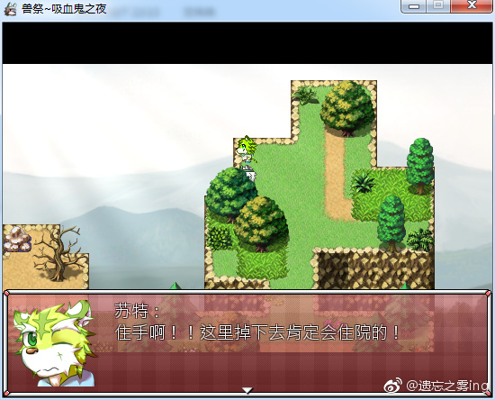
> 正篇《吸血鬼之夜》本来和往常一样的普普通通的周末，苍岚正在为了生活费被初寒花光而苦恼，突然二人被电视
> 
> 节目里提到的“悬赏吸血鬼的照片”的广告所吸引，于是乎，为了解决贫困潦倒的生活状况，二人决定出门寻找好友一起踏上“寻找”吸血鬼的冒险（？）

## 家有大猫

> 这是一个关于某个普通大学生突然看到了三位猫科动物神灵的故事。
> 
> **有没有幻想过毛茸茸的兽人出现在身边？如果他们是自幼就听过大名的神明怎么办？在家有大猫的故事中，你会很快发现美梦成真需要付出的代价。**
> 
> 神像里真的住着守护神，祭祀的表演台下也有神明观看？家里世代是乩童，但如今只是个普通大学生的林天辽，从没想过身边会突然多出三个猫科兽人神灵。
> 
> 得到了封印已久的灵力，看到了原本隐形的神明。对此一点都不兴奋的林天辽，作为普通人的生活还要继续。穿梭在日常与非日常间，他与三只大猫一起的故事匆匆开始了。
> 
> 还没有来得及让他庆幸自己有了阴阳眼，几个突然出现的神灵就开始给阿辽规划起了人生。林家的守护神林虎希望阿辽能在毕业后回老家从事神职，原住民部落的云豹神灵李克劳则相信阿辽是部落新祭司的最佳人选。就连学校舞蹈社的学长颜书齐，也被不知道从哪里来的石虎精给附了身，一直拖着阿辽想让他陪自己为一个乡下小庙复兴香火。还没搞清楚到底发生了什么的阿辽，就这样被推进了不一样的世界线。
> 
> 令阿辽意外的是，这些神灵并非如他想象的那般迂腐，这也让这个不关心鬼神之事的孩子重新思考起民间信仰在现代的意义。不过，他的课程表可不允许他来做个传统文化大巡礼，所以现在要由你来为他做决定了。
> 
> **家有大猫的故事含有同性恋爱的剧情。**

官方微博：[家有大猫微博](https://weibo.com/u/5843616745)

## 雄兽岛的秘密
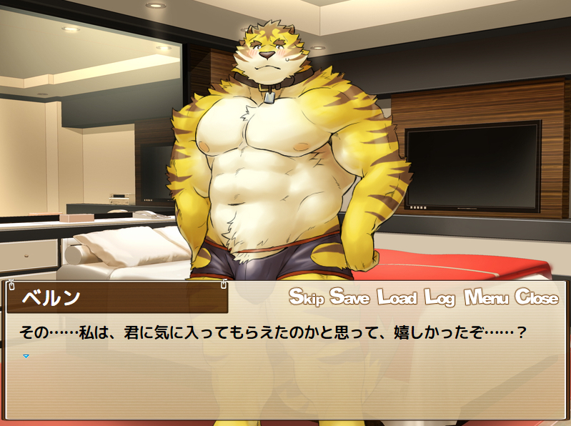
> 現代の桃源郷とも言われているオスケモアイランドに来た主人公が、オスケモといちゃいちゃするビジュアルノベルゲームとなっております。 
> 
> 小説『オスケモアイランドの秘密』の後日談となりますが、簡単なおさらいのためのシナリオが含まれているので読んでいなくても遊んでいただけるかと思います。 
> 
> 下記のたくさんの人にご助力いただいて、やっと完成できました。 
> 
> 楽しんでもらえると嬉しいです。 

## 尾牙

> 大军所向披靡，你将率领喷射火焰的野猪，释放芥子毒气的臭鼬，还有呕吐伞兵猫头鹰引领一场变革。来自 Monaco：What's Yours is Mine 开发组的最新力作《尾牙》是一款包含单人模式，在线对战，分屏对战，精彩重放等许许多多内容的创新即时战略游戏。
> 
> 建设基地，指挥军队，吞噬敌人！
> 
> **肉之圣战**
> 
> 形形色色的角色统统被卷入一场决定谁做食肉者，而谁沦为刀俎的战争。游戏将通过内容丰富的单人战役演绎充满黑色幽默的鼠族变革史。
> 
> **无尽的可重玩性**
> 
> 过程生成式的地图，佐以丰富的自定义参数，每一次的对局都会带给你独特的体验，玩家必须靠谋略而非背板来取得胜利。
> 
> **即开即玩**
> 
> 每局游戏约为5~12分钟，可以分屏本地双人对战，针对手柄和键鼠都进行了充分的优化， 《尾牙》是一款能令新人和老手都满意的爆米花式即时战略游戏。

## 亮晶晶：闪闪王国

> Shiness is an Action-RPG developed by indie development studio Enigami, which will let you travel in a captivating universe doomed to destruction ever since the fragmentation of the planet Mahera...

## 以太之战
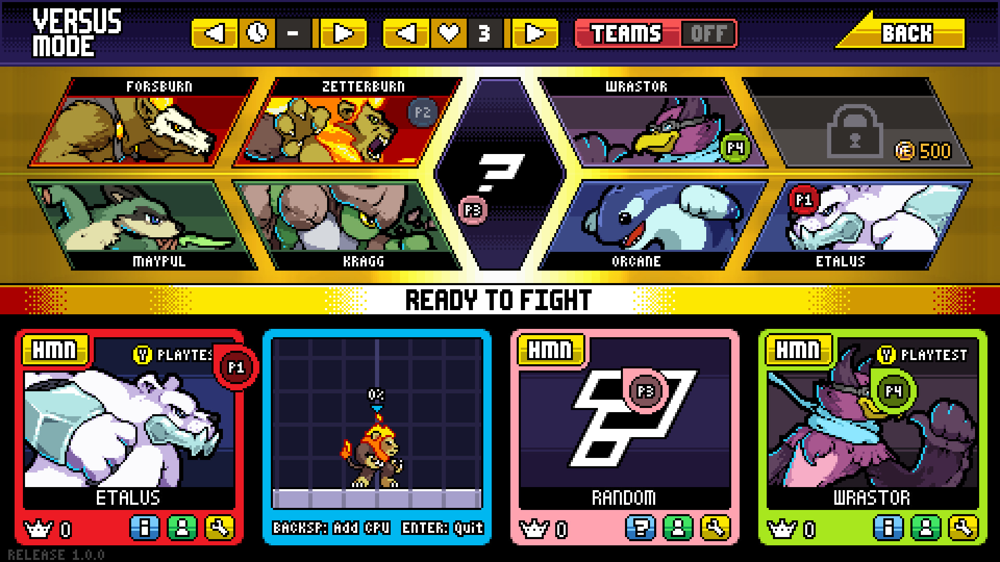
> RIVALS OF AETHER is an indie fighting game set in a world where warring civilizations summon the power of Fire, Water, Air, and Earth. Choose a Rival to bring into the battlefield and manipulate the powers of the classical elements and animal movement. Praised for its competitive gameplay and intensive training tools, Rivals of Aether is the perfect entry to the Platform Fighter genre.

## 林中之夜

> NIGHT IN THE WOODS is an adventure game focused on exploration, story, and character, featuring dozens of characters to meet and lots to do across a lush, vibrant world.

## 鳞翼天使

> You, the player, are an ambassador for Earth sent through a mysterious portal into the world of dragons. Explore a town full of secrets and the people who keep them in this compelling sci-fi visual novel with slice of life and dating sim elements.

## 大调小调完整版

> A highly engaging visual novel, with memorable characters and multiple endings. Traverse worlds, solve a murder mystery -- and partake in political revolution. Inspired by greats such as Steins;Gate, Tales of Symphonia, Persona 4 and Future Diary. An unforgettable science-fiction/fantasy adventure!

## 你看见过我的野兽吗？
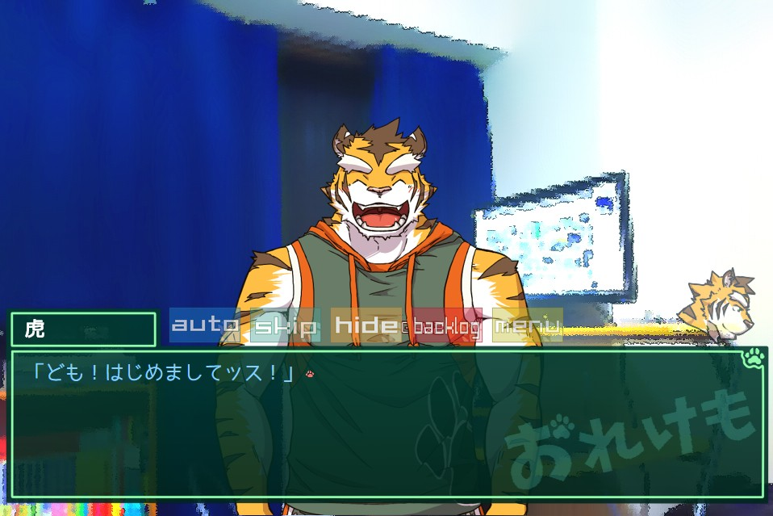
> 急成長中のSNS『おんらいん』。 
> 
> 幅広いコンテンツを取り扱うそのSNSで、主人公：犬飼 春（イヌカイハジメ）はとあるコミュニティを管理しています。 
> 
> 三連休を目の前にしたある日、どこか見覚えのあるIDから、突然のメッセージが……！ 
> 
> メッセージの送り主、和虎を「たった三日間で！？」攻略できるのか！ 

## Great Troubles
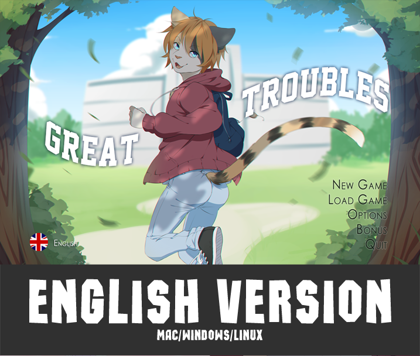
> At the beginning of the second semester a new student from the countryside is transfered to a famous city school. 
> 
> School days promised to be interesting and fun, but something went wrong...

## Rack 2:Furry Science
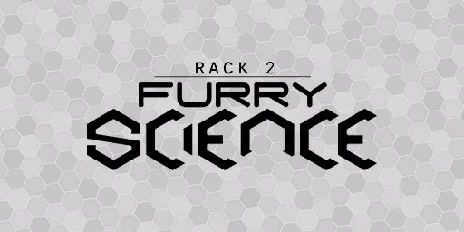
> Rack 2 is the successor to Rack. 
>
>The game will be thematically similar to Rack: you'll perform sexual experiments in a laboratory environment, using the proceeds from your research to unlock more clients, more gadgets, and more ways to experiment.

## 传说：命运之路

> Stories: The Path of Destinies is an Action RPG, an enchanted storybook filled with madcap fantasy tales, each told by a zippy narrator attuned to the player’s choices and actions.

## Mugen Delga Action
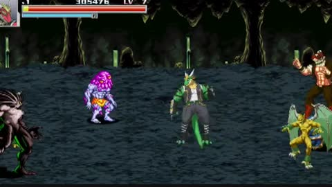
> This is our mini game "Mugen Delga Action" !! It Release Today. 
> 
> It is also showed that our team isn't gone, we're just busy with life. 
> 
> SO please be patient for Original MUGEN Delga full version.

## 阿门罗

> 《阿门罗》将富有深度的卡牌战术游戏，策略性丰富的桌面游戏，以及角色扮演游戏三种风格融为一体，让玩家体验华丽盛大的冒险之旅。 
> 
> 您将扮演阿门罗一个家族的勇士，在王国里寻找、策划、探索、雇佣特工、击败怪物、施展法术，并与其他玩家展开对抗，为完成终极目标：攻入宫殿，成为阿门罗的统治者而奋斗。阿门罗王国无比美丽又危机四伏，随处都可能有灾祸和强盗藏身。除此之外，更有一种称为“腐化”灾难四处蔓延，王国中的生物无一幸免。

## 蛮荒兽族
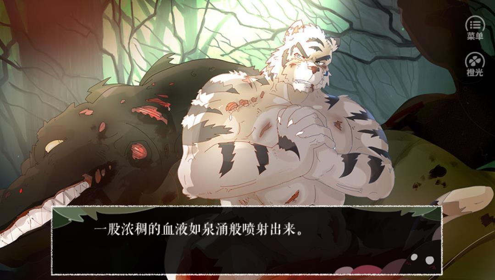
> **一切都始于那个燃烧着喧嚣的盛夏。**
> 
> * 第一话　南柯一梦——人情冷漠心灰冷，唯能寄意浮世梦。　
> * 第二话　萍水相逢——黯然回首伤流年，但求与君初相见。　
> * 第三话　野性蛮荒——背水一战不眠夜，勇武凶悍蛮荒血。　
> * 第四话　塞翁失马——福祸更迭有天意，生死轮回无常理。　
> * 第五话　生日礼物——夏风吹散心头苦，落雨涤净眼中雾。　
> * 第六话　朴素誓言——红尘滚滚尽余欢，长路漫漫不胜寒。
> * 第七话　同床共枕——酒意微醺情难却，夜色朦胧心相悦。　
> * 第八话　游园惊魂——善恶取舍争论起，咫尺天涯恐别离。　
> * 第九话　水月镜花——聚散莫测泪凄楚，分合难料梦荒芜。　
> * 第十话　血脉交融——因爱甘心入虎口，为情宁愿舍乡愁。　
> * 番外篇之一　莫离——无法传达的爱　（13000点历练解锁）　
> * 番外篇之二　风烈——夜空下的思念　（15000点历练解锁）　
> * 番外篇之三　萧凯——南柯梦　　　　（17000点历练解锁）　
> * 番外篇之四　真相——两难抉择　　　（无限制）　　　　　　

## 笨蛋部
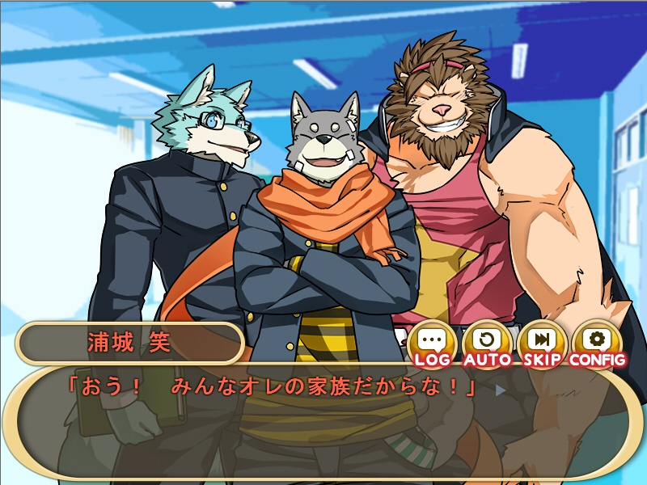
> 遠くて近い未来。突然変異で獣人という新しい種族が誕生し、気付けば世界の人口は大きく変動していた。
> 
> 世界の大半を獣人が占め、人間は希少な種族へと変化してしまった。
> 
> 人間という人種を理由に中学時代を虐められて過ごした主人公は自分自身を変えようと選んだ獣人だらけの高校で、
> 
> ひょんな事から『バカ部』という部活に入る決意をする。
> 
> バカ騒ぎして皆を楽しませる事を目的とした部活で日々を過ごし、主人公は何を思うのか――。

## 凯之传奇

> 10 years after its initial release, Legend of Kay - Anniversary is a thoroughly remastered version of the original game: high-resolution textures; new, more detailed character models; modern rendering techniques and crystal-clear surround sound give this great classic a new shine.

## FaceRig

> FaceRig is a program that aims to enable anyone with a webcam to digitally embody awesome characters. The output can be recorded as a movie or streamed to Skype, Twitch, Hangouts or any service that traditionally uses a webcam in real time.

## 彼时的约定
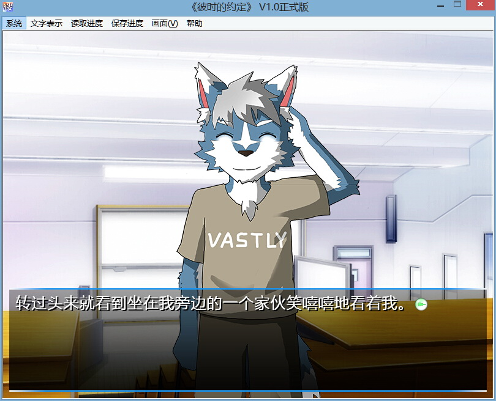
> “时间，不停止流逝。
> 
> 青春，是一片森林。
> 
> 我们，寻找也等待。
> 
> 只为，遇到那个人。”
> 
> 大三的学期末，接着暑假来临。
> 
> 主人公一武同学，遇到了很多人。
> 
> 命运的齿轮在我们看不见的角落转动着。
> 
> 三年前无疾而终的思绪......又再一次鼓动。
> 
> 随着时间的流逝，不着痕迹地在心中留下伤痕。
> 
> 人生很漫长，青春却短暂；我想，这是我青葱岁月的尾声。

## Willy Bear Beach
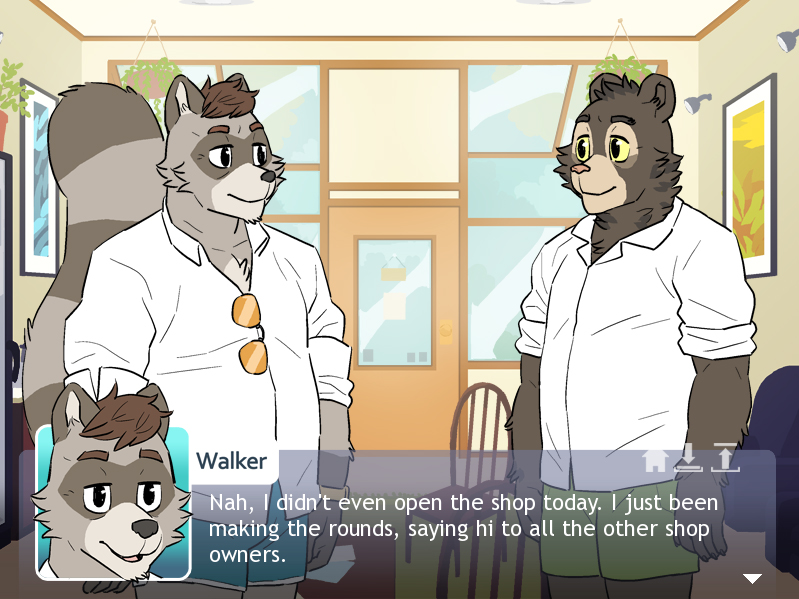
> Willy Bear lives in the idealized east coast town of Cape Bottom Sail, where everyone is friendly, flirty, and carefree! As the player, you'll guide Willy through an average day, where you'll run into friends both old and new, and maybe even bring one of them back to your place for the night!
> 
> Willy Bear Beach is a visual novel with a cute, light story, and branching paths. It's a short game with eight different endings, and it's designed to be played through several times. It contains explicit scenes and is for adults only.

## Another Bookmark
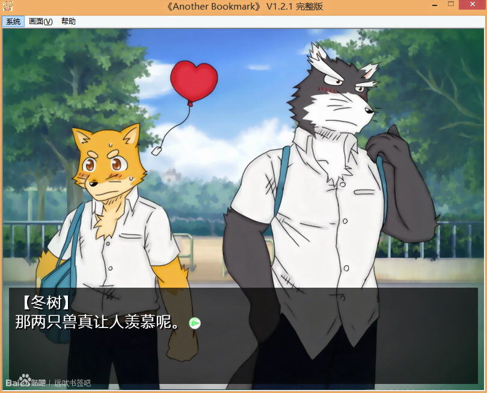
> 基于《远吠书签》原作的世界线有所交集。
> 
> 世界观构成、全新的人物、和原创的故事！
> 
> 这次是完整修正版~因为某些底层改变恕无法提供补丁升级。
> 
> “我曾以为时光的流淌悄无声息。
> 
> 然而那个暑假的些许误解，完全改变了这一切。
> 
> 在那充满矛盾与复杂情感的内心深处......
> 
> 如果曾经的时光可以停留，我想我会一直赖着不走。”
> 
> 人生很漫长，青春却短暂；这次，我把这个故事讲完。
> 
> 注：《远吠书签》原作的漫画作者已支持。

## 愛する君へ
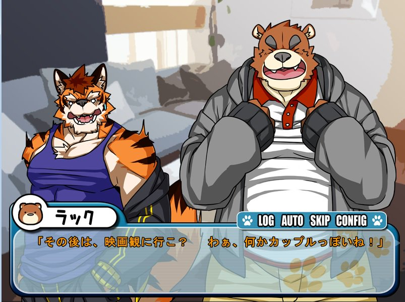
> こんにちわ、KENNです。
> 
> はちと一緒にフリーライトノベルゲーム（R-18)作っちゃいました！！
> 
> 本当は４月１日にリリースしよう！って話になってましたが
> 
> 遅れに遅れて今日になってしまいました。
> 
> フリーなので是非やってみてください！！
> 
> ちなみに、pixivでの先行配信になります。
> 
> ２０日後の６月１日あたりには先行配信は終了し
> 
> 今後サイトに無料配布していく予定です。

## ケモノ戦士の夜這い
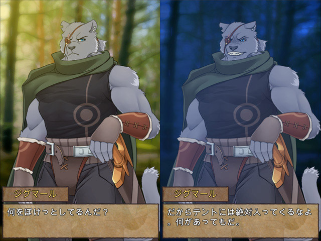
> ケモノ戦士「ジグマール」に雇われた「コルビー」(あなた)は 
> 
> クエスト最後の日を迎えていた。 
> 
> ジグマールは森の中でテントを張り、すでに眠りについている。 
> 
> 夜番を引き受けたあなたは、密かに抱く恋心を抑えきれず、 
> 
> 「決して入るな」と言われていたジグマールが眠るテントに忍びこんでしまう。 

## Dust: An Elysian Tail
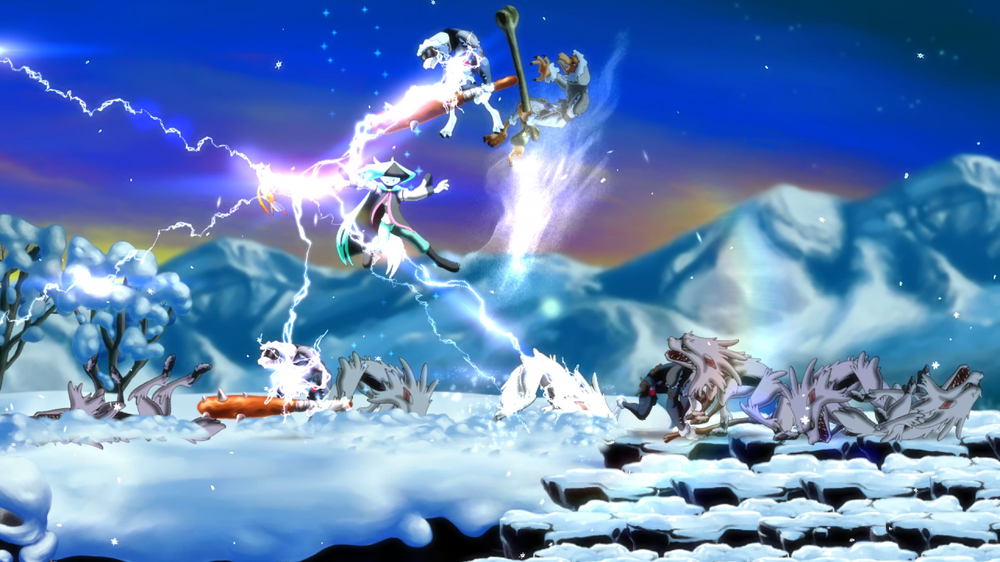
> Immerse yourself in a gorgeous hand-painted world on a search for your true identity. As the mysterious warrior, Dust, your action-packed journey will take you from peaceful glades to snowy mountaintops and beyond. At your disposal is the mythical Blade of Ahrah, capable of turning its wielder into an unstoppable force of nature, and the blade's diminutive guardian, Fidget. Battle dozens of enemies at once with an easy-to-learn, difficult-to-master combat system, take on a variety of quests from friendly villagers, discover ancient secrets and powerful upgrades hidden throughout the massive, open world, and uncover the story of an ancient civilization on the brink of extinction as you fight to uncover your own past.

## ゾウの引越屋さん
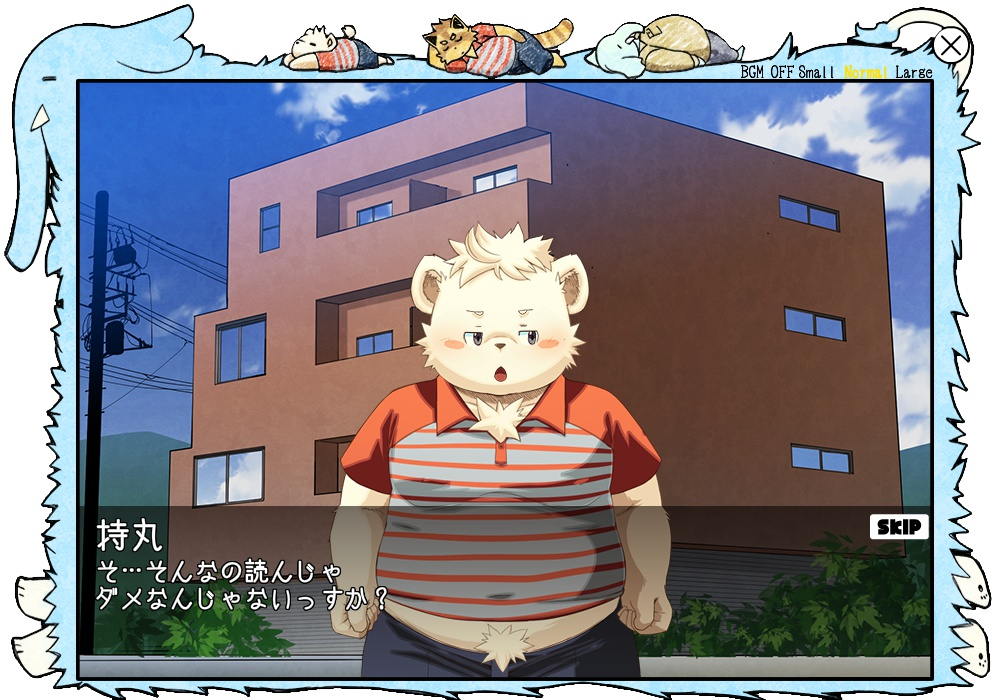
> 大きなゾウさんの経営する小さな引越屋さんで一夏のバイト体験をしよう！
> 
> 心も体もでっかくて、料理の得意なゾウ獣人、重田社長
> 
> 仕事の先輩の（いつも汗臭い）アライグマ獣人の御手洗さん
> 
> バイトの同僚で、まだ精液の香りもしないシロクマ獣人の持丸くん
> 
> 選択肢を選んでいくことで３人の登場キャラと
> 
> むふふなイベントが起きたりしますｗ
> 
> ニオイフェチの主人公が体験する数日間を
> 
> ほのぼのエッチなノベルゲームでお楽しみください！

## Mugen Delga
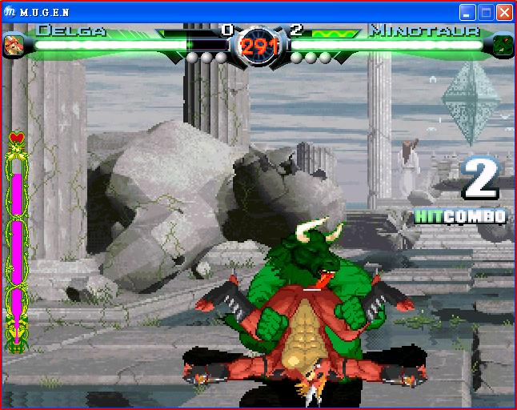
> 操作方式:類似外頭的大型機台格鬥遊戲 使用MUGEN的系統製作 可以到設定區更改設定
> 
> 遊戲中可以選擇九位可以虐待 性侵 吞食 DELGA的角色 
> 
> 也可以自己選擇當DELGA 讓對方(電腦)對DELGA進行各種攻擊
> 
> 遊戲中偶而會出現BUG 如果出現該狀況 最簡單的解決方式就是ESC 重新開遊戲 或是重開對戰畫面

## Hello, 吳鍊
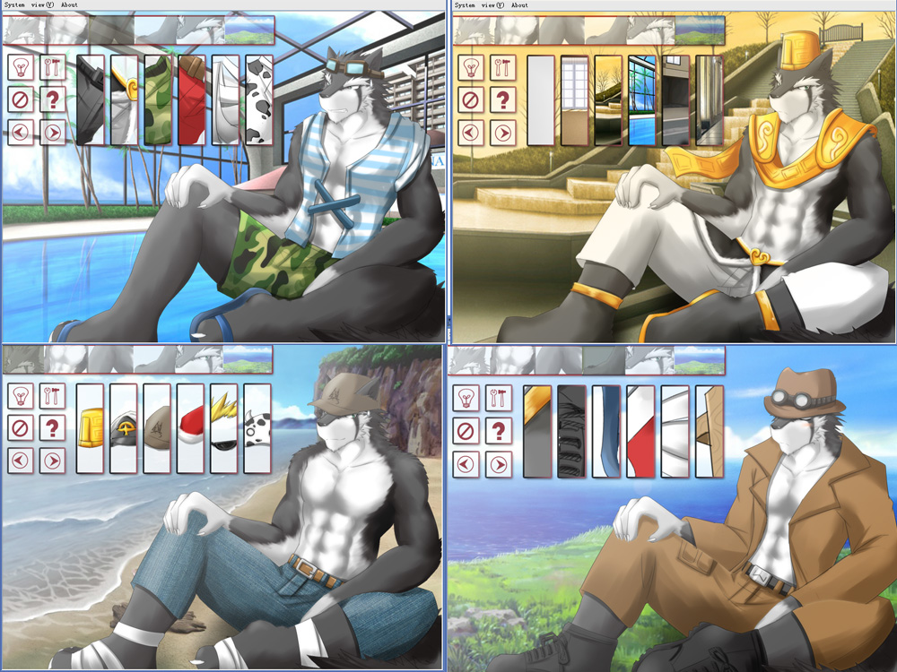
> 吳鍊是台湾漫画《机甲盘古》中的角色，这个小游戏就是给他换衣服的XE小游戏。游戏中一共有15套衣服可供选择和搭配。另外也可以改变表情哦XD

## 咱的夏天。

> 在高考前的最后一个暑假，在城市的主角收到小时候住的村子（水乡村）里朋友来信。因为祖父母还住在那里，主角就决定回老家探望。
> 
> 主角搭公车回到水乡村，遇见在巴士站等待他的虎彦，稍晚参加朋友们为他举办的欢迎会，介绍九个主要角色之后进入分歧点，在此选择故事进行的八条路线（其中一条路线包含两位主要角色）。

## Blank Blood Delga

> 1. 主要角色是 Delga
> 2. 射擊的角色仍然是小妹
> 3. Delga 的所有死亡動作完成
> 4. Delga 的所有特殊武器動作完成

## Escape 逃
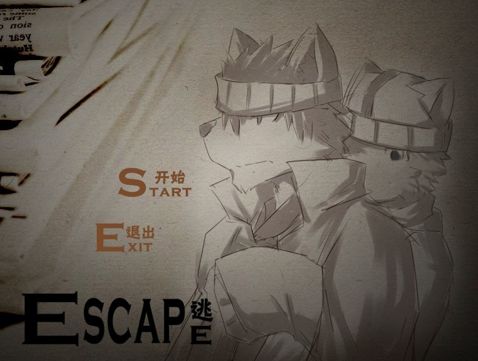
> 1998年春节前夕，形单影只的邵立冬终于鼓起勇气向自己一直喜欢的对象告白。随后，两人一起逃离了原本的生活，去创造属于自己的世界。但是新的生活并不像他想象的那样美好……

## Kemono Code
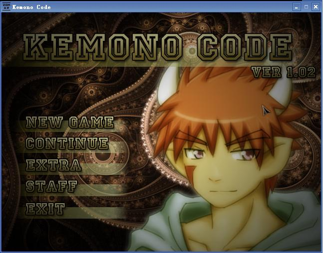
> 来自魔族的半兽半魔的青年伊沃，突然转学到一所兽人学园生活。这里是一个无论环境还是理念都与魔族大相径庭的世界。这里有闷骚的学纪委员长、放荡的足球队员、拜金的老师、害羞胆小的舍友，伊沃究竟能否在这里找到属于自己的真爱呢？
